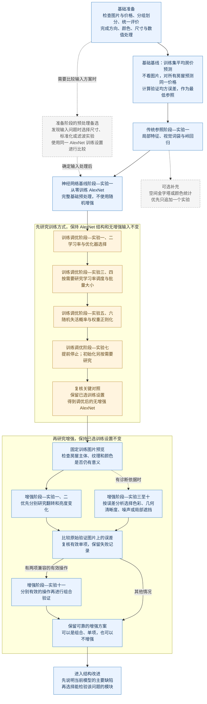
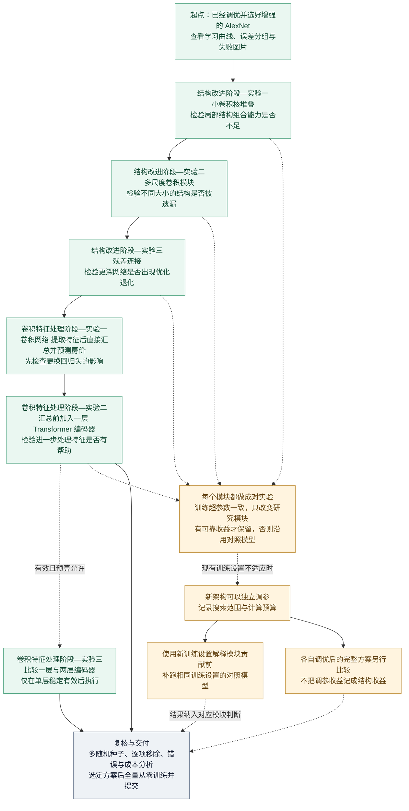

# 房屋图像价格预测项目设计

**2026-10-03最新执行决定：** 用户授权复核Adam 0.001，然后进入训练调优实验三。将优化器复核范围缩减为最有希望的Adam候选，新增种子2027、2028，复用其2026结果与AdamW 0.0001三种子对照；不再继续Muon剩余候选。Adam三种子平均验证均方误差必须下降且至少两个同种子改善，否则保留AdamW。选定后比较固定学习率与余弦衰减（周期60轮、最低初始值1%、无预热），先2026，再2027、2028逐组复核；其他配置包括40轮起、耐心15轮、最多60轮的停止协议不变。每组完成样本、初始化、配置、误差分组和泛化差距检查并更新报告后才继续，异常即停。实验三完成后不自动进入实验四。迁移后的缓存适配需先核验文件、输入等价性和训练核心逻辑一致性。

更新日期：2026-10-02。本文是项目唯一设计文档，统一定义问题、研究假设、评价协议、数据处理、方法设置、实验顺序与反馈决策。课程硬性要求以项目说明 PDF（本地证据：`../COMP90086_2026_Project.pdf`）为准；本文中的模型、划分比例、超参数和晋级阈值均为项目设计，不是新增课程要求。

**当前执行顺序更新（2026-10-02）：** 用户明确选择暂不提前训练调优。先完成正在运行的预处理单因素多种子复核，再以相同训练配置验证兼容的预处理组合，确定输入方案后再开展第5章训练调优。此安排优先于下文早期按需预处理流程；当前队列不因文档更新而重启。六项单因素初筛已完成，直接拉伸与频域滤波进入复核，尚未确定最终输入方案。

## 0 实验安排与阅读说明

本项目先以训练集平均房价建立不使用图片的基础基线，再研究传统局部特征回归和 AlexNet。确认网络能够正常学习后，先调整训练参数，再研究数据增强。随后根据仍未解决的问题，选择小卷积核堆叠、多尺度卷积、残差连接或小型 Transformer 编码器进行改进。传统路线只占少量预算，主要工作放在神经网络的逐步实验和结果解释上。

所有网络均从随机初始化开始训练，不使用预训练权重，也不接着上一实验的权重继续训练。后一个实验继承的是前面验证有效的设计，而不是必须叠加前面尝试过的全部模块。目前已完成数据探索、正式分组划分和代码实现，并验证平均房价基线及传统路线、AlexNet 的小样本运行。尚未开展完整模型比较或选定最佳方案。运行方式见[实验代码说明](../scripts/experiments/README.md)，配置见[实验配置索引](../scripts/experiments/configs/README.md)。

### 0.1 实验如何命名与衔接

实验统一采用“阶段名称—实验一：具体研究内容”的命名方式。例如，“训练调优阶段—实验一：固定学习率大小比较”和“增强阶段—实验五：小角度旋转”。每个阶段内部重新编号，名称直接说明要做什么，不再要求读者记忆字母编号。

文中使用“对照模型”表示本次改动前的模型，“候选模型”表示应用本次改动后的模型。“保留模型”是比较后决定继续使用的模型，可能是候选，也可能仍是对照模型。

**比较规则分为两类。** 要判断某项结构改动是否有效，两个模型使用同一套训练超参数，只改变正在研究的因素。不同架构也可以分别调参，再比较各自调优后的完整方案，但这种差异不能全部归因于结构。若新架构调出了新的训练设置，需要补跑使用相同训练设置的对照模型，才能继续讨论模块贡献。

### 0.2 基线、训练调优与增强筛选流程

基础预处理在初始实验前完成。拉伸、中心裁剪、提高分辨率或滤波属于有条件的备选研究，不再默认占一个主要筛选阶段。无增强网络无法学习时先检查实现和训练参数，不用数据增强掩盖收敛问题。

### 0.3 根据缺陷选择结构改进

图中的结构顺序是默认研究顺序，并不意味着必须全部执行。如果小核堆叠后已经出现训练退化，可以先研究残差；如果误差分析没有提供进一步研究特征融合的依据，可以暂缓编码器。每一步先完成比较与保留决策，再进入下一步。图中的独立调参结果也必须回到相应模块的判断中，不能跳过成对验证直接宣布模块有效。

### 0.4 完整实验一览表

下表汇总正文全部已编号实验，并列出准备、复核和交付任务。主线按照“建立基线、训练调优、筛选增强、改进卷积结构、研究编码器对卷积特征的进一步处理”的顺序推进。预处理备选统一放在前面的实验准备部分，紧接完整基础预处理和 AlexNet 小样本训练检查。只有发现输入问题时才选择相关候选，不要求六项全部执行；基础预处理本身在所有初始实验前完成。

表格同时列出对比实验和执行任务。带“阶段—实验”编号的行用于比较方法或参数；“实验前准备”“阶段结果复核”“最终评测”和“最终交付”则直接说明需要完成的工作，不占用实验编号。执行要求中，“必须完成”表示进入下一步前的必要工作，“优先开展”表示本轮优先投入预算，“按需开展”表示有诊断依据且预算允许才执行。后续对照模型始终是此前保留的方案，不一定是最近尝试的候选模型。所有模型实验均从零训练，只继承配置。

| 实验或任务名称 | 执行要求 | 对照方案或工作依据 | 具体内容 | 进入条件与结果用途 |
| --- | --- | --- | --- | --- |
| 实验前准备：数据与评价规则 | 必须完成，最先执行 | 不作为算法性能对照 | 检查图片与价格对应、重复分组、训练验证划分、价格单位和评价程序 | 冻结划分与评价协议，防止数据泄漏和指标错误 |
| 实验前准备：完整图像预处理 | 必须完成，初始实验之前 | 不设置缺少基础处理的弱基线 | 校正方向、统一颜色、等比缩放补边、转换数值范围并归一化 | 确保训练与推理输入一致，详细规则见实验准备章节 |
| 实验前准备：AlexNet 小样本训练检查 | 必须完成，正式基线训练之前 | 与正式基线相同的 AlexNet 回归结构和初始训练设置 | 仅取训练侧少量图片，关闭随机增强，检查图价对应、梯度、训练误差下降、耗时与显存 | 只检查实现能否正常工作，不评价泛化；检查后重新随机初始化，开展正式基线训练 |
| 预处理备选阶段—实验一：拉伸尺寸调整 | 按需开展，准备阶段发现输入问题时执行 | 完整基础预处理的 AlexNet，关闭增强 | 用直接拉伸替换等比补边 | 检验边框与比例变形的取舍，不要求逐项全部执行 |
| 预处理备选阶段—实验二：中心裁剪 | 按需开展 | 同一预处理对照 | 短边缩放后中心裁剪，替换等比补边 | 检验主体占比与周边视野损失，不与拉伸组合 |
| 预处理备选阶段—实验三：提高输入分辨率 | 按需开展 | 同一预处理对照 | 等比补边尺寸从二百二十四提高到三百二十 | 检验细节收益与计算成本，保持聚合和回归头设置 |
| 预处理备选阶段—实验四：训练侧颜色标准化 | 按需开展 | 同一预处理对照 | 用训练侧通道统计替换固定数值归一化 | 仅用训练侧拟合，记录补边归一化后的变化 |
| 预处理备选阶段—实验五：空间低通滤波 | 按需开展 | 同一预处理对照，不滤波 | 在缩放前加入确定性高斯低通 | 有噪声诊断依据时执行，关注局部纹理损失 |
| 预处理备选阶段—实验六：频率低通滤波 | 按需开展 | 同一预处理对照，不滤波 | 在同一位置加入确定性频率低通 | 有频谱诊断依据时执行，不将两种滤波设置差异简单归因于处理域 |
| 基础基线：训练集平均房价预测 | 必须完成，正式划分确定之后 | 不看图片，无需训练模型 | 仅计算训练侧平均房价，对每张验证图片输出这个价格，再计算验证均方误差 | 检验传统特征和神经网络是否比直接猜平均房价更有用 |
| 传统参照阶段—实验一：局部特征与房价回归 | 优先开展，辅助路线 | 训练集平均房价基线 | 提取 SIFT 局部特征，建立视觉词袋，用岭回归预测价格 | 检验局部纹理能提供多少信息，仅用训练侧拟合词典与回归器 |
| 传统参照阶段—实验二：空间金字塔 | 按需开展，与颜色补充优先选一项 | 传统局部特征基线 | 将全图词袋改为全图与四个区域的空间聚合 | 无序词袋可能遗漏布局时，检验粗略位置的增量价值 |
| 传统参照阶段—实验三：颜色统计补充 | 按需开展，与空间金字塔优先选一项 | 传统局部特征基线 | 追加全图与区域颜色统计，词典和回归器保持不变 | 检验灰度局部描述子未保留的颜色信息是否有用 |
| 传统参照阶段—实验四：回归器替换 | 按需开展，低优先级 | 传统局部特征基线 | 将岭回归替换为支持向量回归，保持特征不变 | 有证据怀疑线性映射受限时，比较完整回归器及其参数设置 |
| 传统参照阶段—实验五：视觉词典大小 | 按需开展，低优先级 | 传统局部特征基线 | 词数从二百五十六增加到五百一十二 | 检验局部模式表示是否过粗，同时记录成本 |
| 传统参照阶段—实验六：明暗统计补充 | 按需开展，低优先级 | 传统局部特征基线 | 单独追加平滑亮度与局部亮度残差统计 | 根据明暗相关失败研究外观信息，不声称恢复物理光照 |
| 传统参照阶段—实验七：梯度结构补充 | 按需开展，低优先级 | 传统局部特征基线 | 单独追加区域梯度方向和幅值统计 | 检验更粗的边缘结构能否补充局部描述子 |
| 神经网络基线阶段—实验一：AlexNet 房价回归 | 优先开展，神经网络主线起点 | 平均房价基线与传统特征参照 | 从零训练 AlexNet，使用完整基础预处理，不使用随机增强 | 建立初始学习曲线；跨路线比较不解释为单一因素贡献 |
| 训练调优阶段—实验一：固定学习率大小比较 | 优先开展 | 初始无增强 AlexNet | 固定 AdamW，比较三个学习率 | 先检查学习速度与稳定性，再保留适用学习率 |
| 训练调优阶段—实验二：优化器选择 | 优先开展 | 已完成的 AdamW 学习率候选 | 与带动量的随机梯度下降比较，两者各有三个学习率候选 | 同预算比较优化器及学习率设置，公开衰减语义差异 |
| 训练调优阶段—实验三：学习率变化策略比较 | 按需开展 | 已选优化器与固定学习率 | 比较固定学习率和余弦衰减，不同时增加预热 | 学习后期震荡或改善缓慢时执行 |
| 训练调优阶段—实验四：批量大小 | 按需开展 | 当前保留的训练设置 | 比较有效批量十六、三十二和六十四 | 固定学习率与最大轮次，报告更新次数差异 |
| 训练调优阶段—实验五：随机失活概率 | 优先开展 | 当前保留的无增强 AlexNet | 两处原有随机失活共同比较零、零点二和零点五 | 研究泛化差距，不同时更换回归头或失活位置 |
| 训练调优阶段—实验六：权重正则化 | 优先开展，分支分别比较 | 从当前模型关闭惩罚和衰减，建立共同参照 | 分别研究绝对值惩罚、平方惩罚；采用 AdamW 时另研究解耦权重衰减 | 不重复叠加惩罚；保留关闭前结果，按验证误差选择 |
| 训练调优阶段—实验七：提前停止 | 优先开展 | 已选训练设置，关闭提前停止 | 比较关闭与开启，最大轮次相同，双方都保存最佳权重 | 检查节省的成本与错过后期改善的风险 |
| 训练调优阶段—实验八：初始化检查 | 按需开展 | 当前初始化规则 | 单独登记并比较候选初始化 | 仅在实现正确而梯度或学习仍不稳定时执行 |
| 阶段结果复核：训练调优的关键改动 | 必须完成，选定训练方案之前 | 各项改动对应的对照配置 | 用三个随机种子复核，必要时补查随机失活与正则化交互 | 冻结调优后的无增强 AlexNet，作为增强阶段共同参照 |
| 实验前准备：增强图片预览 | 必须完成，每种增强首次训练之前 | 固定抽取的原始训练图片 | 展示变换前后图片，检查主体、纹理、颜色与数值范围 | 发现明显信息损伤时先修订增强幅度，再进行训练 |
| 增强阶段—实验一：水平翻转 | 优先开展 | 调优后的无增强 AlexNet | 仅开启水平翻转 | 检验对左右构图的依赖，验证图片不做随机变换 |
| 增强阶段—实验二：亮度变化 | 优先开展 | 同一无增强 AlexNet | 仅改变训练图片亮度 | 检验曝光差异的影响，不与翻转同时开启 |
| 增强阶段—实验三：对比度变化 | 按需开展 | 同一无增强 AlexNet | 仅改变对比度 | 曝光或照片处理差异有诊断依据时执行 |
| 增强阶段—实验四：饱和度变化 | 按需开展 | 同一无增强 AlexNet | 仅改变饱和度，不改变色相 | 色彩敏感时执行，检查是否破坏外墙和植被信息 |
| 增强阶段—实验五：小角度旋转 | 按需开展 | 同一无增强 AlexNet | 仅作小幅图像平面旋转 | 构图倾斜敏感时执行，先预览裁边和填充影响 |
| 增强阶段—实验六：小幅平移 | 按需开展 | 同一无增强 AlexNet | 仅作小幅水平与垂直平移 | 检验对精确居中构图的依赖，检查边缘信息损失 |
| 增强阶段—实验七：轻度裁剪 | 按需开展，后置 | 同一无增强 AlexNet | 保持宽高比，仅轻度减少可见面积 | 主体可见性复核通过后执行，不把强裁剪混入增强设置 |
| 增强阶段—实验八：高斯模糊 | 按需开展 | 同一无增强 AlexNet | 仅加入轻度随机模糊 | 低清晰度组误差偏高时研究，关注纹理损伤 |
| 增强阶段—实验九：高斯噪声 | 按需开展 | 同一无增强 AlexNet | 仅加入轻微随机噪声 | 有噪声敏感性证据时执行，不假定等于真实相机噪声 |
| 增强阶段—实验十：局部擦除 | 按需开展，后置 | 同一无增强 AlexNet | 仅随机擦除一个小区域 | 怀疑依赖单一局部线索时执行，先检查关键结构是否被遮住 |
| 增强阶段—实验十一：有效增强组合 | 按需开展，有两项兼容的有效操作后执行 | 无增强及各单项增强 | 固定顺序组合已验证有效的操作，比较单项与组合 | 不能把单项改善率相加；无可靠收益时保留单项或无增强 |
| 阶段结果复核：增强方案的关键改动 | 必须完成，选定增强方案之前 | 无增强模型与拟保留的增强候选 | 用多个随机种子复核关键单项和组合效果 | 冻结预处理和增强方案，再进入架构比较 |
| 结构改进阶段—实验一：小卷积核堆叠 | 按需开展，主线重点 | 选定增强后的 AlexNet | 第二层大卷积核改为两个小卷积核 | 检验局部结构组合能力，接口和其他训练条件一致 |
| 结构改进阶段—实验二：多尺度卷积 | 按需开展，主线重点 | 小核实验后保留的模型 | 将第三层替换为多分支卷积模块 | 不同大小结构可能被遗漏时执行；小核无效则沿用原模型 |
| 结构改进阶段—实验三：残差连接 | 按需开展，主线重点，可按诊断提前 | 当前保留的卷积模型 | 保留主卷积分支，增加投影捷径与相加 | 针对深层优化问题；不另外增深主分支，新增参数计入成本 |
| 架构训练方案调整：独立调优与相同训练设置复核 | 按需开展；采用新训练设置解释模块贡献时必须补跑对照 | 改动前的架构及候选架构 | 各架构可独立搜索；解释模块贡献前，补跑使用同一新训练设置的对照架构 | 分开报告同超参数模块对照与各自调优后的完整方法比较 |
| 卷积特征处理阶段—实验一：直接汇总特征预测房价 | 必须完成，开展编码器实验之前 | 卷积结构阶段保留的模型 | 保留 卷积网络，将特征整理为三十六个位置向量，直接取平均，再用小型回归头预测；不加编码器 | 先检查更换原有大型全连接头的影响，为编码器建立直接对照 |
| 卷积特征处理阶段—实验二：加入单层 Transformer 编码器 | 按需开展，检验进一步融合不同位置的信息是否有帮助 | 实验一的直接汇总模型，同时参考此前保留的卷积模型 | 在特征汇总前加入一层编码器，让各位置根据其他位置的信息更新表示，再沿用相同的汇总与回归方式 | 比较有无编码器的差异；只有超过较强参照，才考虑作为最终模型 |
| 卷积特征处理阶段—实验三：比较一层与两层编码器 | 按需开展，单层稳定有效后执行 | 实验二的单层编码器模型 | 仅把编码器从一层增加到两层，其余共享设置一致 | 检查进一步处理是否值得增加计算成本，以及是否更容易过拟合 |
| 最终评测：所有方法的统一指标对比 | 必须完成，确定最终方案之前 | 同一验证划分上的平均房价基线、传统方法及各阶段保留模型 | 统一按原始房价尺度计算均方误差，以多种子平均均方误差为核心比较标准；平均绝对误差和高价尾部均方误差辅助解释 | 所有方法使用相同样本、价格单位和评价程序，不因方法不同更换主指标；资源成本单独报告 |
| 最终评测：稳定性与逐项移除 | 必须完成，确定最终方案之前 | 最终候选及对应对照 | 多种子复核，逐次移除实际保留的增强或结构因素 | 检查收益是否稳定，以及各因素在组合中是否仍有价值 |
| 最终评测：分组误差与资源比较 | 必须完成，确定最终方案之前 | 关键阶段保留的方案 | 比较价格段、图像质量组、失败案例、训练与推理成本 | 解释改善来自哪里，公开尾部退化与资源取舍 |
| 最终交付：全量重训与测试推理 | 必须完成，最终方案冻结之后 | 已冻结的最终方案 | 根据开发阶段确定的训练时长，在全部训练记录上从零重训 | 测试集仅用于最终推理，不参与参数选择或统计拟合 |

准备阶段若开展预处理比较，应使用已通过检查的 AlexNet，在相同训练设置下分别训练基础处理对照与候选，并在同一验证集评价。小样本训练检查只检查实现，不能代替预处理效果比较；可复用设置完全一致的正式基线结果。选定输入处理后再进入后续训练调优和增强筛选。

所有增强单项共用同一个调优后的无增强参照及训练设置；架构阶段则根据前一步的保留决定更新对照。组内研究哪个参数，才允许改变哪个参数，其余共享条件一致。预处理若被替换，需登记新版本，并重跑受影响的基线和关键对照，不能继续混用旧成绩。

正文按表中的主线顺序展开。每个阶段只保留需要回答的问题、具体设置、对照方法和继续条件；尚未登记的研究方向集中列在相关阶段末尾。

“最好”只表示已搜索候选中验证证据较好的方案。若没有可靠改善，保留原方案也属于完整结论。当前尚未运行正式模型实验，负责人、日期和实际计算预算待确定。

## 1 任务是什么以及为什么难

### 1.1 预测目标与项目范围

输入一张房屋外观照片，预测一个售价，单位为千美元。这是回归任务，不是房型分类。照片可以提供建筑外观、纹理、庭院和环境信息，但无法完整说明地段、内部面积、装修及交易条件；外观相近的房屋仍可能价格差异很大。

课程要求以项目说明（本地证据：`../COMP90086_2026_Project.pdf`）为准。课程没有要求必须使用课外模块，也没有限定只能使用传统方法或某种网络。课程允许符合限制的预训练特征，但本项目采用更严格的范围：只用课程提供的图片和价格，所有网络从随机初始化开始训练，不使用任何预训练权重或模块，也不接着前一实验的权重继续训练。

课程明确禁止使用在本任务或提供数据集上训练过的预训练模型、课程范围外的 SoCal 原始图片或元数据，以及预训练多模态大语言模型。测试图片不能用于训练、伪标签或调参，不能查找测试真值。文件名、编号、文件顺序和训练测试匹配结果均不作为预测特征。借鉴 AlexNet、VGG、Inception、ResNet 和 Transformer 的结构需注明来源，具体组合及实验由本组完成。

### 1.2 数据与预测文件

数据位于 `comp-90086-2026/house_dataset/`。

| 文件 | 内容 | 用法 |
| --- | --- | --- |
| `train.csv` 与 `train/` | 八千张图片及价格 | 划分训练与验证，价格只用于各自允许的用途 |
| `test.csv` 与 `test/` | 三千张图片，无价格标签 | 完整性检查及最终推理 |
| `sample_solution.csv` | 三千行格式示例，价格均为五百 | 只参考格式，不能作为测试真值 |

图片编号字段为 `imageid`，包含文件后缀；价格字段为 `price`。例如价格五百四十九点九表示五十四万九千九百美元。最终预测文件按测试清单顺序写入三千行，只包含上述两列，不加索引，编号唯一、覆盖完整、价格有限。本文统一采用非负预测，不设价格上限。

项目说明、平台副本和本地示例文件的名称略有不同，平台价格示例也存在单位歧义。当前遵守项目说明明确的千美元单位；未经课程更正，不因网页示例改变输出尺度。

### 1.3 已有证据与待验证解释

已有全量数据探索（本地证据：`../analysis_outputs/20260921T042923Z_7a378d1a/report.md`）及[代码验证记录](../scripts/experiments/VERIFICATION.md)。正式划分现包含六千三百九十九张训练图片和一千六百零一张验证图片；小样本运行只检查代码，不作为模型效果证据。历史探索成功解码全部一万一千张图片，均为三通道彩色图，清单没有缺失、重复编号或图价对应错误。

| 已知现象 | 对实验设计的影响 |
| --- | --- |
| 训练价格为一百九十五至两千千美元，均值为七百二十点六四八，中位数为六百三十九点九 | 价格分布右偏，需同时检查整体和高价尾部误差 |
| 旧均值基线中，约百分之九点九的高价验证样本贡献百分之五十六点六的平方误差 | 均方误差仍是主指标，但不能只看总体数字 |
| 图片宽高、构图和清晰度不同，常见尺寸为四百乘二百七十七及四百乘三百 | 初始实验前统一尺寸与数值处理，再按证据研究增强 |
| 图片 `738.jpg` 与 `861.jpg` 内容相同，价格分别为六百七十九点九九和六百九十九点九九 | 保留两条原标签并划入同组，不自行改价 |
| `1078.jpg` 与 `3568.jpg` 目视高度相似，旧划分分在两侧 | 正式划分保守同组，避免重复造成过于乐观的验证结果 |
| 训练内和测试内各有一个完全重复组，跨训练与测试有四组 | 只作审计，不通过匹配向测试图片复制价格 |
| 简单图像统计与价格的单变量相关性较弱 | 手工特征是否有用仍需回归实验，不能由相关系数直接下结论 |

历史报告保留完整尺寸、异常候选和旧基线分数，不在本设计重复罗列。正式划分确定后重新计算基线。探索中标记的五百三十一条价格异常候选不是已确认错误，不能自动删除。

实验顺序对应不同问题：先确认输入和学习过程正常，再处理优化与过拟合；接着检验拍摄变化的影响；最后才研究局部表达、多尺度处理、深层优化和编码器。后续实验由已有误差支持，不预设每种模块都有效，也不把所有模块机械叠加。

## 2 统一评价与比较规则

### 2.1 只保留三个关键预测指标

所有方法使用同一验证划分、相同价格单位和同一评价程序。先按图片编号对齐真实价与预测价，再计算以下指标；缺失预测、重复编号和非有限数值须先修复，不能删除异常记录后继续报分。

| 指标 | 如何计算 | 作用 |
| --- | --- | --- |
| 均方误差（MSE） | 对全部验证图片的预测误差先平方，再取平均；单位为千美元的平方 | 唯一核心标准，越低越好，用于选择模型和保存最佳权重 |
| 平均绝对误差（MAE） | 对全部验证图片的预测误差取绝对值，再取平均；单位为千美元 | 辅助说明平均相差多少钱，比平方误差更容易理解 |
| 高价尾部均方误差 | 对真实价格超过训练侧第九十分位数的验证图片计算均方误差，并标明样本数 | 检查总体改善是否牺牲高价房表现，不替代整体均方误差 |

最终预测结果表只列方法名称、整体均方误差、平均绝对误差和高价尾部均方误差。各方法按整体均方误差比较，不组合成综合分数，也不因某项辅助结果更好而更换核心标准。指标计算参考[回归评价说明](https://scikit-learn.org/stable/modules/model_evaluation.html#regression-metrics)。

随机训练方法使用二零二六、二零二七和二零二八三个种子，分别计算上述指标，再报告均值和标准差。标准差说明运行波动，不是新增预测指标。平均房价基线报告单一确定值。不能先平均不同种子的预测，再将结果当成单模型成绩；那属于另行评价的集成模型。

训练时间、推理时间和峰值显存单独列在成本表中，保持相同硬件和计时口径。完整方法比较允许各架构分别调优；模块消融仍要求共享训练超参数一致，两类表使用同样的三个指标。均方误差差异不稳定时应复核或注明无法确定优劣，可因成本保留简单模型，但不能因此称其预测更准。

这张比较表来自开发验证集，不是独立测试集成绩；训练损失、不同划分、扰动诊断和 Kaggle 成绩不混入同一列排名。相对改善百分比仅在筛选或解释具体对照时计算，不再作为结果表的固定指标列。

### 2.2 价格缩放与预测还原

神经网络训练时将原始价格除以一千，改善目标的数值尺度；原始价格本身已经以千美元计量。预测后再乘以一千，恢复课程要求的单位，负预测统一置零。不按训练集最高价设置输出上限。

训练损失在未截断的网络输出上计算；官方尺度主指标在恢复单位并应用固定非负下限后计算。同时保存未截断预测、对应均方误差和非正输出数量，防止裁剪掩盖模型失效。若非正输出较多，优先检查单位、初始化及训练过程。

后续对数目标分支使用明确的另一种变换，必须记录逆变换。不同目标空间的训练损失数值不能横向比较；只能比较恢复到千美元后的同一组评价指标。

### 2.3 按问题选择必要的分组分析

高价尾部是固定保留的分组，因为已有探索表明少量高价样本可能贡献较多平方误差。阈值只从训练侧计算，冻结后所有模型共用；该组为空时记为无法计算，样本少于三十条时说明结果不稳定。

其他分组只在解释具体问题时使用。例如亮度增强实验可比较明暗图片组，分辨率实验可比较原图尺寸组，价格相关失败可按训练侧第二十和第八十分位数区分低、中、高价。质量边界、价格阈值和各组样本数都要记录，不能根据某模型的验证成绩临时划出有利分组。分组内沿用均方误差，必要时补充平均绝对误差，不增加新的指标种类。

整体评价始终包含全部验证记录。有争议标签可单独复核，但不能通过删除难样本改善主表。评价程序、分组阈值和输出处理共同版本化，修改规则后重算受影响结果。

### 2.4 公平比较与选择规则

研究某个参数或模块时，只改变登记的研究因素，其余共享条件保持一致。架构可以分别调优，但分别调优后的成绩比较的是完整方法。若要把收益归因于新增模块，必须补跑采用相同训练设置的对照架构。必要的新增参数、归一化和接口变化要说明，不能笼统声称所有细节完全相同。

首次筛选使用训练种子二零二六；关键候选及对应对照再使用二零二六、二零二七和二零二八成对运行。最终以平均验证均方误差为核心，检查至少两个种子是否同向改善。平均房价基线没有训练随机性，只计算一次。

均方误差相对改善百分之二是优先复核的工程门槛，不是显著性标准；不足这一幅度不直接判为无效，但优先级较低。平均绝对误差或高价尾部误差恶化超过百分之五时，必须解释取舍，不能改用有利指标宣布胜出。差异不稳定时保留较简单的对照或标记证据不足。

每轮保存原价验证均方误差最低的权重，同分取较早轮次。所有模型使用同一划分、评价单位、输出处理和误差分组。反复利用验证集选方案会产生选择偏差，多种子不能消除它；候选数量、失败实验和搜索成本都要公开。

## 3 实验准备与预处理

### 3.1 数据检查与已有分析

使用已有[数据分析程序](../scripts/analyze_dataset.py)，运行说明见[脚本说明](../scripts/README.md)。核查清单列名、数量、编号唯一性、价格有效性、文件对应和完整解码；错误不能静默跳过。沿用已验证的分析环境，安装训练依赖前另行核对兼容性。

已有探索在统一的一百二十八乘一百二十八灰度缩略图上统计亮度、对比度、极亮极暗比例和拉普拉斯方差，原始宽高比另外记录。这只是质量分析尺度，不是模型输入尺寸。质量特征的最低和最高百分之一用于人工复核，不自动判定坏图，也不直接沿用为正式验证分组阈值。

文件和解码像素哈希分别检查字节重复与内容重复。近重复候选用六十四位差值哈希、汉明距离不超过四及索引树检索，排除完全重复；最多保留五万对，达到上限时记录搜索未完整。哈希可能漏掉裁剪、重拍和不同视角，候选仍需看图确认，不自动合并或改价。

必要时对有标签图片做局部特征匹配，再用随机采样一致性方法检查仿射或单应几何。保存最近邻距离比阈值、残差阈值、迭代与置信度、内点数量及空间覆盖。重复窗格可能造成错误匹配，高内点率不单独证明同一房屋；匹配失败也不能排除重复。该步骤服务划分审计，不用于测试价格转移。

测试图片只检查格式、尺寸、解码、对应关系和完全重复。价格相关性、质量案例和近重复研究限于有标签图片。完整分析结果、参数和运行状态保留在已有报告目录，不覆盖历史记录；抽样分析不能替代全量完整性检查。

### 3.2 固定训练与验证划分

1. 用全部训练图片的像素哈希构建完全重复组。
2. 将已复核的近重复边 `1078.jpg` 与 `3568.jpg` 并入组；将相互关联的重复图片合并到同一组。
3. `738.jpg`、`861.jpg` 保留各自标签和两条记录，但必须同组；不平均真值、不按误差挑选保留哪条。
4. 基于组售价中位数进行与探索性数据分析一致的排序分层，固定划分种子为二零二六，约百分之八十用于训练、百分之二十用于验证。接受组完整性导致的小幅行数比例变化。
5. 校验组不跨两侧、每个有标签图片编号恰好出现一次，测试图片不在划分内；写入 `split_v1.csv` 及元信息哈希并冻结。

跨训练与测试重复不参与组划分，也不成为调整训练样本权重的依据。除这次已经发现的训练近重复外，仍可能有哈希未发现的同房屋图片；文中不宣称已知完整物业身份。

探索性数据分析的划分草案保持历史状态；正式划分保存为实验划分文件（本地证据：`../scripts/experiments/artifacts/split_v1.csv`），对应划分记录（本地证据：`../scripts/experiments/artifacts/split_v1.json`）。旧划分和旧成绩不与正式结果混用。

组排序分层具体沿用探索性数据分析算法：按组售价中位数及稳定组标识排序，分成最多 10 个近似等组数层，在各层抽取验证组；小数据减少层数并保持两侧非空。控制的是组比例，实际行比例单独报告。相同价格可能分布在不同排序层，这不是严格的固定价格区间分箱。

数据划分种子固定为二零二六，与模型重复训练的种子分开记录。保存原始清单、分组关系、划分文件的内容指纹及训练侧误差分组阈值；每次运行重新核对，具体指纹保存在运行记录中，不在正文罗列。

已有探索性数据分析使用过全部训练标签，因此这是探索性开发划分；反复调参的验证分数存在选择偏差。必要时对少数候选做预先固定的分组三折复核，每折重新拟合词典、标准化器和模型。若据此选择模型，应称交叉验证模型选择，不能称独立盲测或无偏最终泛化评估。

### 3.3 初始实验前完成基础预处理

每个神经网络实验都从正确且完整的输入流水线开始。读取图片后先校正拍摄方向并转为三通道颜色图，再把像素转换成零到一之间的浮点数。图片按长边等比例缩放到二百二十四像素，居中补边到二百二十四乘二百二十四；最后每个通道减去零点五，再除以零点五。

缩放采用带抗混叠的双线性插值，固定处理库和版本。补边各通道均填零点五，归一化后为零；余量为奇数时，多出的一个像素放右侧或下侧。验收时检查尺寸、数值范围、颜色顺序和训练推理一致性。

等比补边能保留庭院和背景，但也可能带来边框捷径。放大低分辨率图片不能创造真实细节。后续只有观察到明确问题时才考虑替代方案，不能省略基础处理后再把修复输入当成实验收益。传统局部特征采用传统视觉路线说明中的独立灰度处理。

### 3.4 用 AlexNet 检查小样本训练

使用后文规定的同一个 AlexNet 回归结构和初始训练设置，全部随机初始化，完成基础预处理，关闭随机增强。仅从训练侧固定抽取少量图片并记录编号、种子和运行时长，不使用验证或测试图片训练。

先检查输入尺寸、图价对应、预测值和损失是否正常，再检查梯度是否更新、重复学习时训练误差能否明显下降，并记录单步耗时及峰值显存。这里检查代码和训练过程是否可用，不评价泛化，不将小样本低误差当作正式结果。若无法学习，先排查标签缩放、损失、梯度和学习率。

检查结束后，正式基线重新初始化模型、优化器和调度器，在完整训练划分上训练，不继承检查权重。诊断时临时调整的随机失活或正则化须记录并恢复，再确认正式初始设置可用。

### 3.5 按需比较预处理备选

发现尺寸、边框、颜色尺度或噪声问题时，才选择相关备选。用同一个 AlexNet、固定训练设置、关闭随机增强，每次只替换一种处理。对照与候选都要正式训练并在同一验证集比较，小样本检查不能代替效果实验。全部备选都同时作用于训练和推理，区别于仅用于训练的随机增强。

| 实验名称 | 具体改动 | 要检查的取舍 |
| --- | --- | --- |
| 预处理备选阶段—实验一：拉伸尺寸调整 | 直接拉伸到二百二十四乘二百二十四 | 去掉补边是否值得建筑比例变形 |
| 预处理备选阶段—实验二：中心裁剪 | 短边缩放到二百五十六，再中心裁剪为二百二十四乘二百二十四 | 主体占比提高是否抵消周边信息丢失 |
| 预处理备选阶段—实验三：提高输入分辨率 | 等比补边边长由二百二十四提高到三百二十，保持自适应池化和回归头 | 细节收益是否值得计算成本 |
| 预处理备选阶段—实验四：训练侧颜色标准化 | 用训练侧各通道的均值与标准差替代固定减零点五、除零点五 | 数值尺度是否改善学习；原始训练图按像素数加权估计，不含增强和补边，补边值仍为零点五 |
| 预处理备选阶段—实验五：空间低通滤波 | 方向与颜色校正后、缩放前，加入五乘五高斯滤波，标准差为零点五个原图像素，反射边界 | 减少干扰是否同时损伤屋顶等纹理 |
| 预处理备选阶段—实验六：频率低通滤波 | 在同一位置逐颜色通道加入高斯频率低通，频率尺度为每像素零点二五周期 | 检查频谱干扰、边界效应与细节损失，不默认叠加空间滤波 |

频率低通先在每侧反射扩展对应原宽或高的百分之十，像素数向上取整。滤波权重为自然指数函数，其指数等于负的二维频率平方和除以两倍频率尺度的平方；逆变换取实部，裁回原范围并截断到零至一。两种滤波的设置和离散实现不同，不能只凭成绩断言空间域或频率域更好。

中心裁剪与拉伸互斥。中心裁剪若另改输出边长，预裁剪短边按输出边长乘以二百五十六再除以二百二十四、四舍五入确定。通道统计每折仅用训练侧估计，最终全量训练重算，并记录补边归一化后的值。至多先组合两项分别有效且兼容的因素；选定后更新输入版本并重跑受影响对照，后续架构实验不随模型暗改预处理。

### 3.6 预处理备选阶段—实验七：频域滤波与直接拉伸组合

目的：判断单项收益是否可以叠加，以及组合是否优于最佳单项。先完成现有单因素复核和逐组分析，再运行组合；保持训练配置一致，训练调优后置。

“无额外预处理”对照仍保留方向与颜色处理、letterbox224、张量转换和固定mean/std=0.5归一化，不代表完全未经处理的原图。不能通过同时取消这些基础操作人为削弱对照。

| 组别 | 滤波 | 尺寸处理 |
| --- | --- | --- |
| B：基础对照 | 无 | letterbox224 |
| F：仅频域 | 原图频域低通 | letterbox224 |
| S：仅拉伸 | 无 | stretch224 |
| FS：组合 | 原图频域低通 | stretch224 |

组合固定顺序为原图方向/颜色处理、频域滤波、直接拉伸、张量及固定数值归一化。滤波参数沿用实验六，不同时调滤波强度。统一使用冻结的6399/1601划分、从零初始化AlexNet、AdamW学习率1e-4、权重衰减1e-4、实际批量4及累积8、dropout=0.5、float32和无增强设置。当前v2采用最多60轮、最少40轮、patience=15、相对改善阈值0.001的统一早停，保存严格最低验证MSE检查点；本轮不采用第5章历史初始配置中关闭早停或15/10的旧候选。

先以seed2026比较四组；B/F/S复用相同协议下已完成且通过完整性检查的结果，仅新增FS。每组结束后先分析再继续；如组合不优于最佳单项，先检查误差分组和随机波动，再记录是否值得复核，不自动扩大参数搜索。拟推荐组合时补齐2027/2028三种子比较。组合平均MSE须低于最佳单项且至少2/3种子改善，同时报告MAE、尾部MSE及成本取舍；无稳定收益则保留单项或基础对照。现有自动队列选出的输入方案仅作为组合验证前的阶段性结果。

报告FS相对B/F/S的逐种子变化，以及交互量MSE(FS)-MSE(F)-MSE(S)+MSE(B)：负值表示在MSE加性尺度上的额外收益，正值表示收益抵消，结合种子波动和按原图分组的配对区间解释，不能直接把改善率相加。结合长宽比分组、价格分组、训练验证差距与案例检查收益来源；“去补边增加画面占比”“滤波抑制噪声”属于待验证机制，不能仅凭总指标证明。

拉伸与中心裁剪互斥；空间与频域低通可能重复损失纹理，暂不组合。其他因素只有获得独立证据后再加入，不进行全组合穷举。当前频域缓存保存的是最终letterbox224张量，不能复用于FS；组合需从原图生成独立stretch缓存及配置键，验证数值等价，缓存构建成本单列。

记录归入`output/experiment_record/01_preprocessing/combinations/`，包括配置、预测、指标、逐组review、交互分析和最终决策。执行细节见组合验证记录计划（本地证据：`../output/experiment_record/01_preprocessing/combination_plan.md`）。组合目前尚未加入自动队列；实施时保留冻结源码、环境和缓存指纹检查，不改写历史结果。选定输入后再进行训练调优；若训练调优改变了预处理相对效果，需要在统一新训练设置下补关键对照，不把训练收益归因于预处理。

## 4 建立基础基线与模型参照

### 4.1 训练集平均房价预测

不看图片，对每张验证图片都预测训练侧平均房价，再计算验证均方误差。例如平均售价为五十万美元，就对所有房屋预测五十万美元。这类似分类中始终预测训练集最多的类别，回答“看图片并训练模型，是否比直接猜平均价格更有用”。

房价是预测目标，均方误差是评价指标，也可以作为训练损失。训练均值使训练数据上的常数预测均方误差最小，但不保证在验证集上仍最优；不能用验证价格计算这个均值。当前只保留均值基线，不再单列中位数预测。

### 4.2 传统局部特征与岭回归

传统路线作为辅助参照，先检测局部关键点，用 SIFT 描述附近梯度与纹理，再聚合成视觉词袋，最后用岭回归预测价格。局部描述子不是屋顶、门窗或材质标签；视觉词袋把不同数量的特征转成固定长度，但会丢失精确位置。SIFT 和词袋有课程依据，接入房价岭回归是本项目设计。

传统参照阶段—实验一：局部特征与房价回归，采用以下固定起点。

1. 校正方向并转为彩色图，用带抗混叠的双线性插值将长边等比缩放到三百二十像素，不补边，再转八位灰度图，保留关键点归一化坐标。
2. 每图最多保留二百五十六个 SIFT 关键点，按响应从高到低排序，同分再按位置、尺度和方向排序。尺度组内层数为三，对比度阈值为零点零四，边缘阈值为十，初始高斯标准差为一点六。一百二十八维描述子各自除以欧氏长度，零向量保持零。
3. 仅从训练侧每图均匀无放回抽取最多一百二十八个描述子，合并后最多抽二十万个。用小批量聚类拟合二百五十六个视觉词，批量为二千零四十八，初始化三次，最多迭代一百次，随机种子与本次实验一致。
4. 将每图全部保留的描述子分配到最近词中心，得到二百五十六维计数；先除以计数总和，再逐项开平方，最后除以向量欧氏长度。没有关键点时输出零向量并记录，不删除图片。
5. 用训练侧均值和标准差逐维标准化，零方差尺度设为一。岭回归惩罚系数为十，拟合截距，使用奇异值分解求解；目标价格除以一千，预测后按统一规则还原。

保存关键点数量、零关键点比例及分布，检查是否主要来自树木和围栏。词典、标准化器与回归器只在训练侧拟合，交叉验证和最终重训均重新拟合。回归器替换和空间金字塔实验复用同一划分与种子的基线词典。实现参考 [SIFT 说明](https://docs.opencv.org/4.x/da/df5/tutorial_py_sift_intro.html)。

### 4.3 传统特征的条件扩展

优先只追加空间金字塔或颜色统计中的一项，其余按失败分析和预算决定。每项与传统基线比较，不能同时拼接多种特征后把收益归因于其中一种。

| 实验名称 | 固定改动 |
| --- | --- |
| 传统参照阶段—实验二：空间金字塔 | 全图与二乘二网格分别生成相同词典的直方图，沿用基线归一化；全图乘以二的平方根的倒数，每格乘以八的平方根的倒数，拼为一千二百八十维，再整体单位长度归一化和训练侧逐维标准化 |
| 传统参照阶段—实验三：颜色统计补充 | 在全图和四个区域中，分别计算 Lab 三个颜色分量的均值与总体标准差，追加三十维，总维度二百八十六 |
| 传统参照阶段—实验四：回归器替换 | 特征不变，改为径向基核支持向量回归；惩罚系数十，不敏感区间零点零五，核尺度使用库的尺度规则，停止容差零点零零一，缓存五百一十二兆字节，不设硬迭代上限 |
| 传统参照阶段—实验五：视觉词典大小 | 词数从二百五十六改为五百一十二，描述子抽样保持配对，重新拟合词典 |
| 传统参照阶段—实验六：明暗统计补充 | 各区域记录平滑亮度标准差、第九十与第十分位数之差、局部亮度残差绝对值的均值和第九十分位数，追加二十维，总维度二百七十六 |
| 传统参照阶段—实验七：梯度结构补充 | 各区域计算幅值加权的八方向无符号梯度直方图，再附平均梯度幅值，追加四十五维，总维度三百零一 |

空间金字塔边界点按归一化位置的两倍向下取整，最大网格下标为一。其后逐维标准化会抵消固定正比例缩放，因此不能把结果解释为证明了预设层级权重最优。支持向量回归区间定义在缩放价格上，对应五十千美元；它比较的是整个回归器，参考[官方说明](https://scikit-learn.org/stable/modules/generated/sklearn.svm.SVR.html)。

颜色、明暗和梯度分支均取长边三百二十、无补边的同一彩色图，在转灰度前分出。区域为全图与四格，奇数宽高用整数中点分割。颜色采用固定库版本的标准红绿蓝至 Lab 转换和 D65 白点。亮度代理为红通道乘零点二九九、绿通道乘零点五八七、蓝通道乘零点一一四之和；输入范围为零至一。明暗平滑使用九乘九高斯核、标准差二，残差是原亮度减平滑亮度。梯度使用三乘三 Sobel 核并除以八，方向覆盖零至一百八十度，直方图除以总幅值，无梯度时置零。先在全图滤波再分区，采用反射边界，分位数线性插值。

附加特征独立用训练侧统计标准化后，接在保持不变的词袋特征后，沿用同一岭回归。颜色和明暗共同受光照、反射率、表面方向、阴影及相机响应影响；这些统计是外观描述，不等于真实材质、漫反射率、表面法向量或面积。

若覆盖不足，可另研究密集采样、角点或线段统计；检测位置与描述特征是不同步骤，标准 SIFT 不需要默认先接角点检测。局部二值模式可作为后置纹理候选，方向梯度直方图作为另一传统表示候选。启用前明确采样、参数、维度、归一化和预算，本轮不同时堆叠所有手工特征。

### 4.4 从零训练的 AlexNet 基线

神经网络基线阶段—实验一：AlexNet 房价回归，采用 torchvision 风格的 AlexNet。保留五层卷积和大型全连接回归头，将最终分类输出改为一个没有输出激活的价格预测值。所有层从随机初始化开始训练，不加载权重，不增加批量归一化或局部响应归一化。它是本项目明确规定的回归版本，不声称完整复现历史原版。

| 位置 | 固定结构 |
| --- | --- |
| 第一层卷积 | 三个输入通道，六十四个输出通道；卷积核为十一乘十一，步长为四，补边为二；使用线性整流激活，再进行三乘三、步长为二的最大池化 |
| 第二层卷积 | 输入通道为六十四，输出通道为一百九十二；卷积核为五乘五，步长为一，补边为二；使用线性整流激活，再进行三乘三、步长为二的最大池化 |
| 第三层卷积 | 输入通道为一百九十二，输出通道为三百八十四；卷积核为三乘三，步长为一，补边为一，再使用线性整流激活 |
| 第四层卷积 | 输入通道为三百八十四，输出通道为二百五十六；卷积核为三乘三，步长为一，补边为一，再使用线性整流激活 |
| 第五层卷积 | 输入和输出通道均为二百五十六；卷积核为三乘三，步长为一，补边为一；使用线性整流激活，再进行三乘三、步长为二的最大池化 |
| 聚合与回归 | 自适应平均池化到六乘六，展平为九千二百一十六维；依次经过随机失活、四千零九十六维全连接层、线性整流激活、随机失活、四千零九十六维全连接层、线性整流激活，最后映射为一个价格值 |

输入边长为二百二十四时，第一层卷积后的空间边长为五十五，随后三次最大池化将边长依次降为二十七、十三和六。两处随机失活的初始概率均为零点五，后续只在对应训练调优实验中改变概率，位置和回归头结构保持不变。大型全连接头可能带来过拟合，应通过学习曲线检验，不能在增强实验中同时更换为小型回归头。

若基线无法在现有资源下正常训练，先在验收阶段修订并记录模型结构和训练设置，再以修订版开展全部正式对照。结构参考 [torchvision AlexNet 源码](https://docs.pytorch.org/vision/0.12/_modules/torchvision/models/alexnet.html)，仅借鉴架构，不使用其中提供的权重。

## 5 先调整训练参数

### 5.1 初始训练设置与复现要求

使用完整基础预处理和无随机增强的 AlexNet。下面是待检查的初始设置，不是已验证最优参数。当前硬件为 RTX 2060，显存六千一百四十四兆字节；先实测小样本训练的耗时和显存，再确定正式预算。

| 项目 | 初始设置 |
| --- | --- |
| 目标与损失 | 价格除以一千，采用逐样本平均的均方误差；评价时还原到千美元 |
| 参数初始化 | 整流卷积采用按输入连接数缩放的 Kaiming 正态初始化，普通隐藏线性层采用 Xavier 均匀初始化，偏置为零；输出权重用标准差零点零零一的零均值正态分布，输出偏置为训练侧变换目标均值 |
| 新增模块初始化 | 层归一化缩放为一、偏置为零；位置编码采用标准差零点零二的零均值正态分布；注意力和前馈权重采用 Xavier 均匀初始化，偏置为零 |
| 优化器 | AdamW，全网络学习率零点零零零一，两项动量系数为零点九和零点九九九，数值稳定常数为一亿分之一 |
| 权重衰减 | 系数零点零零零一，偏置、归一化参数和位置编码不衰减，保存参数组清单 |
| 训练预算 | 固定学习率，最多六十轮，每轮验证；初始关闭提前停止，选择验证均方误差最低的权重 |
| 批量与累积 | 实际批量为四，累积八次，通常有效批量为三十二；不丢弃末批，末累积窗口按实际样本数归一化 |
| 随机失活与归一化 | 原有两处全连接随机失活概率均为零点五，不增加批量归一化 |
| 数值精度与读取 | 初始使用单精度计算，两个数据加载进程，固定进程和采样随机状态 |

模型初始化、样本打乱和增强各用独立随机流。结构相同的对照可使用同种子生成的未训练初值；结构不同的共享层按名称和形状使用独立模块种子，新增层另设种子，不声称不同网络拥有完全相同初值。保存初始化指纹与环境版本，参考[复现说明](https://docs.pytorch.org/docs/main/notes/randomness.html)。

显存不足时，先在训练侧检查，再统一调整成对模型的实际批量与累积次数。改精度、预算或优化器也要登记并重跑受影响对照。相同最大轮次不等于相同实际步数或计算量；梯度累积也不会合并批量归一化统计。共享设置下尚未收敛的结论只能限定在当前预算，不直接判定结构无效。

### 5.2 依次研究学习率、优化器与泛化

本阶段从完整基础预处理、无随机增强的 AlexNet 基线开始。保持卷积、池化和回归头结构不变，先确定网络能否稳定学习，再处理过拟合和训练成本。每组实验开始前固定对照配置和候选范围，组内均与同一对照比较，选定后才进入下一组，不穷举所有参数组合。

**2026-10-02执行更新：** 用户已要求以预处理阶段选定的直接拉伸启动训练调优。固定224×224直接拉伸、固定0.5数值归一化、不滤波、无增强；先比较本节登记的三个自适应优化器学习率，再比较三个动量随机梯度下降学习率，每组先完成数值归因再继续。沿用当前40轮起、耐心15轮、改善阈值0.1%、最多60轮的共同停止协议，旧15／10候选不自动覆盖已生效设置。原有0.0001直接拉伸三种子结果在配置及缓存等价性核验后复用。每个优化器的初筛最佳候选再复核2027／2028；以平均均方误差降低且至少两次同种子改善作为保留条件。后续调度、批量和泛化约束仍按诊断结果登记，不在前两项完成前锁定。

按用户分工，本阶段全部新产物放在`output/experiment_record/04_training/`，编号03留给其他同学的传统参照；唯一阅读入口为该目录的`实验报告.md`。先持久化8000张拉伸、固定归一化后的单精度输入张量，验证独立重算与小规模训练等价后复用；不缓存随网络权重变化的特征向量。缓存配置和标签读取、原图及实现指纹均须核验。目录路由由单独登记的运行适配器处理，不修改已冻结核心训练代码或其他同学的记录。

| 实验名称 | 候选设置 | 对照规则与研究目的 |
| --- | --- | --- |
| 训练调优阶段—实验一：固定学习率大小比较 | AdamW 学习率分别为零点零零零零三、零点零零零一和零点零零零三 | 与初始基线比较，其余条件一致，已有相同配置结果直接复用；先排除学习率不合适导致的学习困难 |
| 训练调优阶段—实验二：优化器选择 | 比较 AdamW 与带动量的随机梯度下降；后者动量为零点九，阻尼为零，不使用 Nesterov 加速，学习率分别为零点零零一、零点零一和零点零三 | 两种优化器各使用三个学习率候选，最大轮次、数据和种子一致；这是优化器及其学习率设置的比较，不把全部变化归因于优化器名称 |
| 训练调优阶段—实验三：学习率变化策略比较 | 按需要比较固定学习率与余弦衰减；衰减周期等于最大训练轮次，最低学习率为初始值的百分之一，逐轮更新，不附加预热 | 继承已选优化器和学习率；另研究预热时单独登记，不同时修改 |
| 训练调优阶段—实验四：批量大小 | 按需要比较有效批量十六、三十二和六十四；实际批量固定为四，分别累积四、八和十六次 | 保持学习率和最大轮次不变，报告实际更新次数，不自动按批量缩放学习率 |
| 训练调优阶段—实验五：随机失活概率 | 两处全连接随机失活共同取零、零点二或零点五 | 保持位置与网络维度不变，检验随机失活是否改善泛化 |
| 训练调优阶段—实验六：权重正则化 | 先关闭惩罚和衰减建立共同参照，再分别比较绝对值惩罚、平方惩罚；选定 AdamW 时另比较解耦权重衰减 | 每次只启用一种机制，具体系数见下文，保留关闭前结果，不默认无惩罚更好 |
| 训练调优阶段—实验七：提前停止 | 比较关闭与开启；连续十轮没有达到百分之零点一的相对改善，且已完成至少十五轮时停止，恢复此前验证误差最低的权重 | 最大训练轮次相同；主要检查成本与是否错过后期改善，若采用预热则不早于预热结束停止 |
| 训练调优阶段—实验八：初始化检查 | 仅在梯度或训练仍明显不稳定时登记候选初始化方法 | 不与前述训练因素同时改变，先检查实现和数值问题 |

权重正则化研究的是模型参数，不是图像归一化。绝对值惩罚采用权重绝对值之和，也称 L1 惩罚，系数候选为千万分之一和百万分之一。平方惩罚采用权重平方和的一半，也称 L2 惩罚，系数候选为百万分之一和十万分之一。这两类实验都将优化器内置权重衰减设为零，避免重复施加惩罚。若当前优化器为 AdamW，解耦权重衰减的候选为十万分之一、万分之一和千分之一，显式损失惩罚关闭。

上述惩罚只作用于预先登记的卷积与线性权重，后续包含注意力投影和前馈网络权重，排除偏置、归一化参数与位置编码。惩罚按参数求和，不按参数数量平均，因此不同架构的参数量变化也会影响惩罚总量，不能认为相同系数必然产生相同作用强度。保存参数组、纯数据损失、惩罚值、训练总损失与权重范数；验证均方误差不包含正则项。梯度累积按实际样本数加权，避免每次小批量重复放大惩罚。普通梯度训练下的绝对值惩罚不等于已经删除参数。

AdamW 的解耦权重衰减不等价于在损失中加入平方惩罚。优化器比较阶段暂时继承衰减系数并公开语义差异，随后才在已选优化器中研究正则化，不宣称穷举了所有交互。实现依据 [AdamW 官方说明](https://docs.pytorch.org/docs/stable/generated/torch.optim.AdamW)和[随机梯度下降官方说明](https://docs.pytorch.org/docs/main/generated/torch.optim.sgd.SGD_class.html)。若候选尺度明显失衡，先记录诊断并登记新范围，不在运行中暗改。

提前停止与最佳权重保存分别判断。每轮都保存严格优于历史最低验证均方误差的权重，同分取较早轮次；停止计数则以最近一次显著改善为参照，只有相对降低超过百分之零点一才清零，否则递增。微小改善仍可更新最佳权重，但不清零停止计数。停止时恢复此前最低误差的权重，不采用最后一轮权重。

关闭提前停止的对照也保存完整预算内的最佳权重。因此，在完全相同的随机训练轨迹下，提前停止不会凭空获得更好的权重，重点是节省成本与漏掉后期改善的风险。可以先在已有曲线上模拟停止决策，再以实际运行检查保存和恢复逻辑，模拟不算新增独立训练。若停止早于学习率后期下降，应明确记录；调整等待轮数另立配置。

阶段结束时，用三个随机种子复核关键改动，必要时补查随机失活与正则化的交互。保存选定的优化器、学习率、调度、批量、随机失活、正则化和停止规则，再固定这套方案筛选增强。增强若引发新的优化问题，另行登记修订，并补做有无增强及新旧训练设置的组合对照，不把训练改动隐藏在增强结果中。

### 5.3 目标函数的后置候选

**优化器范围补充（2026-10-02）：** 用户追加SGD、Adagrad、Adam与Muon，保留AdamW作参照。当前队列不断训，追加队列在原队列完成后接续。Adam候选学习率为1e-5、1e-4、1e-3；Adagrad为0.001、0.01、0.1；Muon为0.005、0.01、0.02。SGD和AdamW沿用已登记候选及结果，各方法均有三个初筛学习率，再对各自最佳候选复核三个种子。先做实现及显卡兼容性诊断，不在未验证时直接启动全量训练。

Muon采用明确登记的混合方案：仅两个隐藏全连接权重使用原生Muon，卷积、输出层及偏置固定使用AdamW学习率1e-4。不将卷积权重暗中展平、不将混合方案称为全网络纯Muon。保持原衰减参数分组，并报告不同优化器衰减语义、内部运算精度和成本差异。实现约束及具体参数见登记说明（本地证据：`../output/experiment_record/04_training/optimizer_extension/protocol.md`）。本补充属于第5.2节优化器研究范围，目标函数仍按下文保持不变。

当前主线固定缩放价格与均方误差，不同时改变训练目标。若大残差或高价尾部问题持续存在，可分别登记稳健损失或对数目标实验。稳健损失的转折值为缩放价格上的零点一，对应一百千美元残差；它降低大误差影响，也可能削弱高价学习。对数目标先对价格加一再取自然对数，预测后指数还原并减一，输出偏置随目标重新计算。

不同目标空间的训练损失不能直接比较，仍按原价验证均方误差决定是否采用。对数分布更对称不是充分理由。高价过采样和样本加权不进入首轮，若追加需分别登记，验证仍对原记录等权评价。

## 6 固定训练设置后比较数据增强

### 6.1 一次只研究一种增强

增强要检验的假设是：在售价标签保持不变的前提下，适度改变拍摄条件或可见内容，可能减少模型对偶然图像特征的依赖。它不会增加独立房屋数量，也不能弥补图像缺失的地段等信息。几何裁剪和遮挡可能移除定价线索，因此“房屋实际售价不变”不等于“变换后的图片仍包含足够预测信息”。

下列概率和幅度是保守的实验起点，尚未验证最优。每次读取训练图片时独立判断是否触发操作；触发后在指定区间均匀抽取参数，另有说明者除外。所有单项实验均与调优后的无增强 AlexNet 比较，共用基础预处理和已选训练设置，关闭其他增强。

| 实验名称 | 操作与固定参数 | 假设及主要风险 | 执行优先级 |
| --- | --- | --- | --- |
| 增强阶段—实验一：水平翻转 | 水平翻转，触发概率为百分之五十 | 减少对左右布局的依赖；镜像不是新的独立房屋 | 首轮候选 |
| 增强阶段—实验二：亮度变化 | 亮度乘数零点九至一点一，每次读取均执行 | 减轻曝光差异；过强会遮蔽暗部或亮部细节 | 首轮候选 |
| 增强阶段—实验三：对比度变化 | 对比度因子零点九至一点一，每次读取均执行 | 减轻照片处理差异；可能削弱材质线索 | 按曝光与对比度诊断追加 |
| 增强阶段—实验四：饱和度变化 | 饱和度因子零点九至一点一，触发概率为百分之五十；不同时改变色相 | 减少色彩处理差异；可能扰动植被和外墙颜色线索 | 按色彩敏感性追加 |
| 增强阶段—实验五：小角度旋转 | 绕图像中心旋转负三度至正三度，触发概率为百分之三十，不扩展画布 | 模拟轻微拍摄倾斜；边缘可能被切除，新增角区也可能形成捷径 | 几何候选，先看图复核 |
| 增强阶段—实验六：小幅平移 | 水平和垂直平移分别为图片宽度和高度的负百分之三至正百分之三，触发概率为百分之三十；不旋转、不缩放、不剪切 | 降低对精确居中构图的依赖；边缘房屋细节可能丢失 | 构图敏感时追加 |
| 增强阶段—实验七：轻度裁剪 | 保持原图宽高比的轻裁剪，面积比例百分之九十至百分之一百，触发概率为百分之三十；裁剪后仍走基础预处理 | 检验有限视野变化；没有房屋框，不能保证主体完整 | 后期条件候选 |
| 增强阶段—实验八：高斯模糊 | 高斯模糊，触发概率为百分之二十，核为五乘五，标准差为零点三至零点八原图像素 | 减少对极细纹理依赖；可能抹掉屋顶和材质线索 | 低清晰度组误差较高时追加 |
| 增强阶段—实验九：高斯噪声 | 三个颜色通道分别加入独立高斯噪声，触发概率为百分之二十，均值为零，标准差为零点零一，像素范围为零至一 | 检验对轻微图像噪声的适应；不等价于已证实的真实相机噪声 | 噪声敏感时追加 |
| 增强阶段—实验十：局部擦除 | 单个小矩形擦除，触发概率为百分之十五，面积占原图百分之一至百分之三，宽高比按对数均匀分布在零点五至二之间取值 | 减少对单一局部线索的依赖；随机矩形不等同真实遮挡，可能遮住关键结构 | 后期条件候选 |

旋转和平移使用双线性插值，画布不变，新增区域的三个颜色通道均填零点五。轻裁剪时，将原宽和原高分别乘以采样面积比例的平方根并四舍五入，限制在合法范围内；左上角从可放置位置均匀抽取，记录取整后的实际面积。该操作保持原有宽高比，不能直接套用通用随机裁剪函数的默认范围。

局部擦除根据抽取的面积和宽高比计算矩形，位置均匀抽样，三个颜色通道均填零点五。最多尝试十次，无法合法放置时跳过并计数。模糊采用反射边界；噪声和颜色变换后将数值截回零至一。对比度与饱和度沿用已固定版本的图像处理库定义。实现语义参考[图像变换说明](https://docs.pytorch.org/vision/stable/transforms.html)、[随机裁剪说明](https://docs.pytorch.org/vision/stable/generated/torchvision.transforms.RandomResizedCrop.html)和[随机擦除说明](https://docs.pytorch.org/vision/stable/generated/torchvision.transforms.RandomErasing.html)，本项目设置是否有效仍需实验。

初期不采用垂直翻转、大角度旋转、强透视、强裁剪、强色相变化或全灰度转换。图片线性混合与区域拼接增强也不进入首轮：混合两张房屋图片并不能证明售价按像素或面积线性混合，如研究这些方法，须单独定义回归标签混合假设和对照。自动增强策略同时改变多种操作，不适合本轮定位具体收益来源。

### 6.2 处理顺序与组合实验

训练图片先校正拍摄方向，转为三通道颜色图和零到一之间的浮点数，再执行已登记的确定性滤波，默认不滤波。随机操作依次为轻度裁剪、平移、旋转、水平翻转、亮度变化、对比度变化、饱和度变化、模糊、噪声和局部擦除。最后执行固定的尺寸处理、补边和数值归一化。单项实验只开启一种随机操作，组合实验沿用同一顺序。增强发生在补边之前，避免扰动填充边框；模糊尺度和擦除比例均按实际图片计算，不按最终输入画布计算。

每次读取原始训练图片只生成一个随机视图，沿用原价格，不把增强图复制进验证集，也不改变每轮样本次数和优化步数。增强随机流由训练种子、轮次、图片编号和操作名称分别确定，不能因开启某项操作就改变样本打乱、其他增强或初始化。记录实际触发比例、参数范围与跳过次数，固定特征缓存不能代替在线增强。

正式训练前，从训练侧用固定种子选择 32 张图，每张展示原图及 5 个增强视图，覆盖常见宽高比和价格范围。检查方向、主体可见性、颜色、数值范围、输出尺寸和图价对应。若频繁裁掉屋顶或立面，或擦除遮住主要房屋，应先缩小范围或停用并登记新的增强设置；复核图不能证明全部样本都保留主体，不按验证成绩逐图决定增强是否启用。

先在无增强的 AlexNet 上完成训练调优并保存选定训练设置，再保持这些训练设置不变，逐项筛选增强。分别有效且兼容的操作才进入组合实验。选定预处理与增强方案后，进入模型结构研究。后续架构可以独立调参，但同一组模块对照仍须共用训练条件。传统局部特征路线继续使用自己的确定性输入处理，本轮不优先研究其增强方案。

两项操作分别有效后，再比较无增强、只用第一项、只用第二项及同时使用两项。组合仍须验证，不能相加单项改善率。若无可靠组合收益，保留单项或无增强。概率、幅度和操作顺序改变都要另记配置。

### 6.3 几何变换与深度的适用范围

图像平面中的旋转、平移、缩放、裁剪和指定二维变换不需要先知道真实相机内外参数。内参描述焦距和主点等投影关系，外参描述相机姿态；若要做物理一致的新视角重投影，还需要深度、相对位姿、一致尺度以及遮挡与空洞处理。只有像素位置和内参只能确定一条射线，不能恢复唯一三维点。

整图透视变换只在近似平面或绕光心纯旋转等条件下有明确几何解释，不能一般性模拟相机平移产生的视差。水平翻转和轻微旋转也不等于绕房屋换了真实拍摄方位。弱透视和剪切仅保留为条件方向，先登记幅度并检查图片，不混入已有增强结果。几何依据见[单应变换说明](https://docs.opencv.org/4.5.1/d9/dab/tutorial_homography.html)和[相机模型](https://docs.opencv.org/4.5.1/d9/d0c/group__calib3d.html)。

当前没有深度真值或确认的多视图输入，又不使用预训练模块，因此不执行显式深度网络或三维新视角合成。同一图片的增强版本不是独立双目观测。纹理尺度、遮挡和空间布局可以作为视觉线索，但不能宣称已经测得真实深度、表面法向量或房屋面积。

## 7 根据剩余问题改进卷积结构

### 7.1 每项模块对应什么问题

固定已选预处理和增强后，以此前保留的 AlexNet 为起点，依据学习曲线与失败案例选择结构实验。训练好但验证差时先检查泛化，不默认增加深度；局部细节或尺度问题更明显时，再考虑相应模块。

| 设计来源 | 本项目研究的问题 | 解释边界 |
| --- | --- | --- |
| VGG 的小卷积核堆叠 | 多层局部处理是否更容易组合门窗、屋顶和立面信息 | 步长与膨胀率为一且层间无池化时，两个三乘三卷积覆盖五乘五感受野；非线性和通道也随之改变，不能只归因于核大小 |
| GoogLeNet 的多尺度分支 | 不同大小的房屋与细节是否需要并行处理 | 多尺度不等于尺度不变；分支和通道改变会增加容量或计算，需报告成本 |
| ResNet 的残差连接 | 深层训练退化时，捷径是否改善优化与信息传播 | 残差连接不保证消除梯度消失或过拟合；形状不同需投影对齐并计算新增参数 |

输入、中间、输出通道数相同并忽略偏置时，两个三乘三卷积的权重数为单个五乘五卷积的二十五分之十八；实际通道不同必须重算，不能推断完整 VGG 总比其他模型小。理论感受野也不等于实际梯度贡献集中的范围。

### 7.2 具体替换位置与对照

- 结构改进阶段—实验一：小卷积核堆叠。将第二层的五乘五卷积替换为两个三乘三卷积，通道依次为六十四、九十六和一百九十二。步长均为一，补边均为一，每层后使用线性整流激活。理论感受野仍为五乘五，深度、非线性和中间通道的变化共同构成卷积块结构，不将收益仅归因于卷积核尺寸。
- 结构改进阶段—实验二：多尺度卷积。替换第三层卷积，输入为一百九十二通道。第一路用一乘一卷积输出九十六通道；第二路先用一乘一卷积降到六十四通道，再用三乘三卷积输出一百二十八通道；第三路先降到三十二通道，再用五乘五卷积输出九十六通道；第四路先进行三乘三最大池化，再用一乘一卷积输出六十四通道。所有步长为一，按核大小补边以保持空间尺寸，每个卷积后使用线性整流激活，最终拼接为三百八十四通道。不同时增加批量归一化、辅助头或改动其他层。
- 结构改进阶段—实验三：残差连接。保留第四、第五层卷积作为主分支，其通道依次为三百八十四、二百五十六和二百五十六，均采用三乘三卷积；第四层后保留线性整流激活。捷径使用步长为一的一乘一卷积，将三百八十四通道投影为二百五十六通道。主分支与捷径相加后，再执行原第五层后的激活与池化。主分支不额外加深，新增投影参数计入成本。

只累积通过复核的改动。小卷积核堆叠无可靠收益时，多尺度实验仍从选定增强后的 AlexNet 开始；多尺度模块未通过时，残差实验沿用此前保留的模型。必要时，再从同一个增强后的 AlexNet 分别添加各模块，检查效果是否依赖前序改动。连续实验链本身不能证明每个模块独立使用也有效。

多尺度分支输出空间尺寸必须一致，拼接沿通道维进行。残差块对齐后逐元素相加，不是拼接；训练仍使用房价损失，不需要人工残差标签。辅助回归头、批量归一化、池化位置和通道宽度若另作研究，要单独登记，不隐藏在上述模块比较中。

每组模块对照使用共同训练设置。新架构需要独立调优时，公开搜索范围与成本，再按统一比较规则补跑对照；只继承结构与配置，不继承训练权重。最终对保留的模块逐项移除并从零重训，检查它们在组合中是否仍有价值。

## 8 用编码器进一步处理卷积特征

这一阶段研究的是：卷积网络 已经提取了图片特征，再用 Transformer 编码器处理一次，能否进一步改善房价预测。编码器接收的是卷积特征，而不是直接接收原始图片；它输出的仍是特征，最终价格由回归头给出。三个实验依次区分更换回归头、加入编码器和增加编码器深度的影响。

**三个部分各自做什么。** 卷积网络 将房屋图片转为特征图，表示纹理、边缘及更复杂的视觉信息。编码器通过自注意力，让每个位置根据其他位置的信息更新自己的表示，再通过前馈网络继续变换特征。回归头汇总这些特征，输出一个房价。位置编码提供网格位置信息，使模型有机会利用不同位置之间的关系。

卷积网络 本身也能学习空间关系，深层卷积和原有全连接层已经能够组合多个位置的信息。因此，本阶段不是给 卷积网络 补上完全没有的能力，而是比较另一种处理已有特征的方式。编码器不会增加图片中原本不存在的信息，也不保证效果更好；有限数据下，额外参数可能增加过拟合和计算成本。

| 实验名称 | 从特征到价格的具体过程 | 对照与研究问题 |
| --- | --- | --- |
| 卷积特征处理阶段—实验一：直接汇总特征预测房价 | 保留 卷积网络，将特征图池化为六乘六网格，用一乘一卷积将每个位置映射为一百二十八维向量；加入位置编码并逐位置归一化，直接对三十六个向量取平均，经随机失活和线性回归层输出价格，不使用编码器 | 与此前保留的卷积模型比较，检查用小型回归头替换大型全连接头的影响；这是后续实验的必要对照 |
| 卷积特征处理阶段—实验二：加入单层 Transformer 编码器 | 沿用实验一的 卷积网络、投影和位置编码，在最终逐位置归一化与平均汇总之前加入一层双向编码器；编码器处理后的三十六个向量仍使用相同方式汇总并预测价格 | 与实验一比较，回答编码器整体是否带来增量收益；同时与此前较强的卷积模型比较，避免仅仅超过一个变弱的回归头 |
| 卷积特征处理阶段—实验三：比较一层与两层编码器 | 仅将编码器从一层增加为两层，不同时改变网格数量、向量维度、注意力头数或回归头 | 仅在单层稳定有效后执行，与单层模型比较误差、过拟合程度和计算成本 |

**为什么先做直接汇总对照。** 原 AlexNet 使用大型全连接回归头，加入编码器时需要重新整理特征并调整输出结构。如果直接一次完成这些改动，就无法判断变化来自回归头还是编码器。实验一先固定特征整理和回归方式，实验二只在这个结构中加入编码器，才能清楚地比较新增模块的作用。即使实验一没有超过原模型，它仍是解释编码器增量所需的对照，但不因此成为最终保留模型。

特征网格的三十六个向量对应特征图位置，不等于三十六个独立原图裁块，也不代表模型已经识别出了屋顶、门窗或庭院。每个位置可能已经通过 卷积网络 的感受野包含较大范围的信息。可以用屋顶与庭院的信息相互结合来解释研究动机，但是否学到这种对应关系需要进一步证据。

**固定结构与参数。** 采用卷积结构阶段保留的架构配置，每次重新初始化全部层，不继承其训练权重。保留六乘六的空间池化，一乘一卷积投影至一百二十八维；可学习二维位置编码大小为六乘六乘一百二十八，从小幅随机值初始化。实验一用一处输出前随机失活代替原有两处全连接随机失活，概率继承已选设置，这属于更换回归头时公开的结构变化。

单层编码器的表示维度为一百二十八，注意力头数为四，前馈隐藏维度为五百一十二，采用高斯误差线性激活，内部随机失活概率为零点一。使用前置层归一化，稳定常数为十万分之一；张量以批次维在前，不设置因果遮罩，也不添加分类标记。两层版本各层独立初始化，不能让复制层意外保持相同初值。实现语义参考 [Transformer 编码器层说明](https://docs.pytorch.org/docs/main/generated/torch.nn.modules.transformer.TransformerEncoderLayer.html)。

**如何比较与决定是否继续。** 三个实验使用已选数据处理与增强，卷积网络和新增层共同从零训练，不冻结卷积网络，也不用固定特征缓存代替训练。成对比较与独立调优遵守统一评价规则。

以原价验证均方误差为主，同时查看平均绝对误差、高价尾部、训练与验证差距、多种子稳定性、耗时和峰值显存。单层编码器没有可靠收益时不继续增加层数，保留此前较强方案并记录失败原因。不能仅凭注意力图看起来合理就认定模型有效。

加入编码器同时增加了注意力、前馈网络、归一化和模型容量，因此实验二首先解释的是整个编码器的作用。如果进一步研究收益是否来自跨位置注意力，可另行比较去掉自注意力、保留逐位置前馈网络及残差的结构，并公开参数量差异。本轮不默认增加这项实验，也不单独训练完整视觉 Transformer 或仅解码器模型。

## 9 用结果决定下一步并完成最终评测

### 9.1 从具体问题提出下一项实验

每次先核查配置、单位和收敛，再看整体均方误差、固定分组和逐样本误差。说明哪条证据支持下一项改动，保持其余条件一致。实现错误先修复并重跑，不把修复错误当算法收益。

| 观察到的问题 | 先检查什么 | 可以开展的下一步 |
| --- | --- | --- |
| 训练和验证都差，或不如平均房价基线 | 图价对应、目标还原、梯度更新和训练预算 | 修复实现，再研究学习率和优化器，不直接堆模块 |
| 训练误差低而验证误差高 | 重复泄漏、数据量、模型容量与分布差异 | 比较随机失活、正则化和有动机的增强 |
| 暗图或低清晰度组误差较高 | 样本数、价位组成与真实失败图 | 分别研究亮度或轻度模糊，不同时改变多项操作 |
| 构图轻变就明显影响预测 | 裁剪是否丢主体、补边是否形成捷径 | 小角度旋转、小幅平移，轻裁剪后置 |
| 增强训练误差上升 | 原始无增强训练图上的误差是否也上升 | 区分任务变难与实际拟合退化；必要时缩小幅度 |
| 深层训练退化或梯度异常 | 训练设置、初始化、分支数值尺度 | 优化修正或残差实验，不能仅凭现象认定梯度消失 |
| 小目标细节在早期消失 | 下采样位置、中间特征分辨率 | 预处理分辨率或多尺度对照，两类因素分别研究 |
| 词袋相似但布局不同的图片误差大 | 特征是否集中在背景，是否丢失位置信息 | 传统空间金字塔；神经网络可研究编码器，但需单独对照 |
| 提前停止发生在学习率下降之前 | 验证波动、等待轮数与调度时间 | 另登记停止规则，不暗中延长候选训练 |
| 总体均方误差下降但尾部变差 | 是否由少数样本主导、是否跨种子稳定 | 记录取舍并复核，不更换主指标掩盖问题 |

如果最终架构对原增强方案出现新问题，可以补做 AlexNet 与最终架构在无增强、已选增强下的四组比较。改变数据处理后重跑受影响对照，不能将增强和结构收益混为一谈。

### 9.2 多次运行与最终对比

最终结果表使用统一评价章节规定的列：原价验证均方误差为核心，平均绝对误差和高价尾部均方误差辅助解释，成本单独列出。对齐同一图片逐项比较平方误差与绝对误差，检查收益是否来自极少数高价样本。关键对照按三个相同训练种子复核，不只展示最好的一次。

必要时对重点比较按原始图片组进行一千次成对重采样，种子固定为二零二六，每次对两个模型抽取相同组并带回全部组内记录。按实际记录数计算均方误差，报告候选减对照的差值及百分之九十五区间；跨零表示证据不足。该区间只反映当前样本的不确定性，不替代训练随机性复核，也不消除调参选择偏差。

最后对保留的增强或结构逐项移除，用共同训练设置从零训练。完整方法比较与模块消融分表报告，不把独立调参后的差异全部记为模块贡献。

### 9.3 中间结果如何记录与解释

| 记录内容 | 固定方式 | 用途与限制 |
| --- | --- | --- |
| 学习曲线与网络结构 | 逐轮记录训练和验证误差、学习率、梯度、耗时；保存各层尺寸、通道、核、步长和参数量 | 判断优化、过拟合和容量变化 |
| 卷积核与中间特征图 | 固定训练图片、层和通道选择规则，在初始化、预定中间轮次和最佳权重处保存 | 检查响应是否更新、全零或过早丢失细节；同一通道编号不保证跨模型语义一致 |
| 多尺度与残差分支 | 保存分支均值、标准差、范数，按需要增加梯度统计 | 检查失活和尺度失衡，幅值大不等于价格贡献大 |
| 传统局部特征 | 保存关键点位置、数量、视觉词分布和必要的匹配图 | 判断背景主导或覆盖不足，不把关键点数量当房价证据 |
| 价格归因与编码器注意力 | 固定验证样本，对未截断价格求梯度；保存所选层、注意力头和查询位置 | 展示敏感性，不将注意力热图当因果证据或真实部件识别结果 |
| 失败案例与特征近邻 | 固定随机案例、最大误差和典型成功案例分别标记 | 解释外观相近但价格不同等局限，不只挑好看的图 |

普通特征提取在推理模式下进行，关闭随机失活和统计更新；梯度归因另行开启求导，不执行优化步骤，结束后恢复训练状态。保存原始数值、色条与显示范围，不用每图独立拉伸后的热图比较强弱。热图放大仅用于展示，不代表原始特征拥有同样定位精度。

梯度加权激活图使用最后卷积层和未截断价格输出；若只显示正向响应，不能把暗区解释为没有影响。编码器没有分类标记，保存的是位置之间的注意力，不能套用分类标记到图块的解释。按层传播注意力也不直接等于价格梯度。

可选遮挡诊断在几何处理后、归一化前，将图片分成四乘四网格逐格填零点五，区分真实图片与填充边框。可选扰动诊断分别施加亮度乘零点九或一点一、标准差零点零一的噪声、标准差零点五像素的高斯模糊，再正常预处理。所有对照使用同样扰动，分别报告误差增量与预测变化，原始验证成绩仍为主结果。

这些视图不是新增独立房屋，不增加置信区间中的样本数。用扰动结果选增强属于开发反馈。主成分降维仅在训练特征上拟合；近邻和二维嵌入只作探索，不能凭聚类清晰宣称回归准确。

## 10 最终训练与实验记录

选定方案后，用固定开发协议得到的最佳训练轮次信息，预先确定全量训练时长，例如取该最终配置三种子最佳训练轮次的中位数。随后在全部 8,000 条课程训练记录上重新训练；不再用测试数据选择训练轮次或拟合任何统计量。

上述训练轮次规则只适用于神经网络。若最终选定传统方法，在全部训练图片上重拟合词典、标准化器和回归器，保留预先选定参数，不涉及训练轮次选择。

保存完整模型、训练记录、数值归一化、目标逆变换及推理设置。

最终推理依次执行已冻结的输入处理、选定的特征提取或神经网络、价格预测、目标逆变换和已登记的非负下限处理，再按提交模板顺序输出。测试时关闭随机增强和随机失活，不拟合词典、标准化统计或模型参数。

若需要显示美元，展示层再乘以 1,000；Kaggle CSV 仍按课程 PDF 的千美元要求输出。网页价格示例的单位歧义继续记录，未经课程更正不据示例擅自改变单位。

最终导出按 `test.csv` 顺序生成 3,000 行 `imageid,price`，验证唯一性、覆盖率、有限值和列名。每张测试图片都运行同一模型逻辑，不针对训练与测试重复对复制价格。未知图片即使能解码，也不保证属于同一数据分布；单点输出不等于已校准的置信区间。

集成和测试时增强只在单模型方案稳定后考虑，分别作为“预测聚合方式”独立实验：不重训的水平翻转 测试时增强，或同一配置多种子模型等权平均。必须先在验证预测上评价，记录推理成本；若学习融合权重，应使用训练侧 折外预测 或嵌套划分，不能在同一验证标签上拟合权重后把得分当作独立评价。

### 10.1 每次实验保存什么

每次运行使用新目录，不覆盖旧结果。用完整中文实验名称、日期、随机种子和设置版本识别运行；实验名称用于阅读，实际文件名可遵循程序约定。保存失败和不采用的实验。

| 内容 | 必须保留的信息 |
| --- | --- |
| 实验设置与变化 | 问题依据、确切对照、唯一改动、必要派生变化、完整生效参数和版本 |
| 数据与环境 | 数据和划分指纹、库与驱动版本、设备、精度、随机流和代码版本 |
| 训练过程 | 训练损失、原价误差、学习率、梯度异常、步数、耗时、峰值显存；停止原因及恢复权重 |
| 模型与预测 | 网络权重，或词典、标准化器和回归器；逆变换与推理设置；每张验证图的真实价、预测价和误差 |
| 比较证据 | 主辅指标、固定分组及样本数、逐样本误差差值、曲线、可视化选择规则和成本 |
| 阶段结论 | 采用、保留原方案、放弃、无结论或运行失败，写明下一步及理由 |

完整记录需能够从设置和数据划分追溯到模型、预测和结论。传统方法没有神经网络训练轮次，不强行套用训练曲线字段。已有分析产物保留在原报告目录。训练代码与五十六份配置已实现在实验目录，运行后自动保存上述记录；当前只有平均房价的完整基线和小样本模型检查，尚无完整模型效果结论。

### 10.2 工作量与范围

先以短运行估算成本，再分配预算。优先保证训练调优、增强、关键结构对照及最终复核；传统扩展、预处理备选和更深编码器可按证据暂缓。纯视觉 Transformer、仅解码器模型、其他大规模架构、生成模型及额外自监督预训练不进入本轮。

项目计划需确定负责人和日期，包括划分冻结、基线完成、训练与增强选择、停止新增架构、最终配置冻结和提交检查。当前没有已确认的成员分工或显卡小时预算，不写成已承诺排期。

## 11 课程交付与报告组织

### 11.1 时间与评分

PDF 规定两人小组，项目计划于 **2026-10-04** 截止，最终项目于 **2026-10-25 23:59** 截止。小组需在 Canvas Quizzes 的 Project Group Registration 登记；具体登记截止、时区和后续调整须以 Canvas 为准。项目结束需要自评及队友贡献评价，可能影响个人成绩。

| 评分项 | 分值 | 应形成的证据 |
| --- | ---: | --- |
| 项目计划 | 2 | 任务分工与预计完成日期 |
| 报告写作 | 5 | 组织清晰，图表标注完整，论点可读 |
| 方法与论证 | 10 | 方法正确，设计选择有视觉理论与任务动机支持 |
| 实验与评价 | 10 | 可比较的实验、错误分析和有证据的结论 |
| Kaggle | 3 | 模型预测合理超过简单基线；官方具体算法和数值门槛未给出 |

报告共 25 分。Kaggle 达到或仅略超基线为 1–2 分，随机预测水平或未提交为 0 分，不能由本地平均房价基线改善率推定满分。Canvas 迟交每 24 小时扣总可得分的 10%，截止后 168 小时关闭；这不意味着 Kaggle 同步延长。

### 11.2 正式提交清单

- **项目计划**：使用Word（本地证据：`../COMP90086_project_plan.docx`）或LaTeX（本地证据：`../COMP90086_project_plan.tex`）模板，填写总体思路、模型开发与报告写作分工、日期、沟通安排、组内数据访问/保密/备份方案及双方签名日期。当前本地模板为空白。
- **项目代码**：模型代码、Kaggle 格式测试预测、完整运行说明 和复现所需文件；运行说明应说明图片放置路径及训练/推理方式。不得打包课程训练与测试图片，不整包提交 `.venv` 或探索性数据分析目录；报告可按需使用分析图。
- **项目报告**：IEEE 会议短论文格式的 PDF，A4 正文不超过四页，参考文献可延伸至第五页。方法与实验需让读者不查看代码即可理解，不默认允许正文附录绕过页数限制。
- **Kaggle**：按 PDF 使用学校邮箱和 Register with Google，经 Canvas 链接加入竞赛；队名仅为组员学号，例如 `1234&5678`，否则可能无法识别成绩并计零分。预测既上传 Kaggle，也纳入代码提交。

现有 [scripts/README.md](../scripts/README.md)仅覆盖探索性数据分析。最终交付前需补全模型环境、训练、权重快照获取或加载、推理及复现步骤，并从预期入口实际验证。

### 11.3 报告的证据主线

建议按“任务与困难，随后方法和动机，随后固定评价协议，随后基线及关键改进，随后错误解释与限制”组织。报告应回答每项设计为什么合理、实验是否支持、什么情况下失败，以及下一步如何改进。课件出处支持原理，不替代本任务的实验证据。

正文优先选择一张方法与成本比较表、一张关键消融表和少量有代表性的成功/失败图；曲线或切片只保留支撑主要结论的内容。图表写明样本数、单位、坐标、图例和标题，三种子结果标明数量；不要仅挑成功样本或隐去失败实验。以最终证据安排篇幅，无需将全部内部指标和候选配置塞入正文。

### 11.4 平台规则与待确认信息

依据本地 Kaggle 页面副本（本地证据：`../materials/kaggle_page.md`），尚未核实在线更新：成员各自使用唯一账号并正式组队，每人仅属于一个队伍；不得绕过每日额度、代交他人预测、让其他组用本组预测参赛，或私下跨队共享竞赛代码与数据。提交不得混入人工标注或人工预测的验证/测试信息。组内使用已提供标签进行本地验证不属于新增人工标签。

通用条款还要求核对所用开源代码许可及第三方权利；公开分享应遵循竞赛规定的渠道和许可，不能用公开分享绕过课程原创性要求。队伍合并受人数、累计提交和截止条件约束；公榜与私榜使用不同测试部分，公榜分数不等于最终排名。最终应检查选定的 最终提交项，未选择时的自动机制不能替代主动核查。

目前待确认：Canvas 更新及小组登记/计划提交时刻；Kaggle 截止与时区、每日额度和组队期限；最终提交项 份数及自动选择规则；公私榜比例与课程采用方式；价格单位示例歧义；官方基线；代码包与权重上传限制；Data 页新增说明。副本相对时间不能推算精确截止，通用规则也不能推断本竞赛的具体参数。

## 12 理论依据与来源

### 12.1 课程原理与项目适配

| 项目模块 | 原课件与页码 | 课件实际内容 | 本项目如何适配 |
| --- | --- | --- | --- |
| 深度与几何增强 | CPU Week7（本地证据：`<../../CPU Materials/COMP90086 CV/课件/Week7.pdf>`），2、7–8、13–15 页 | 单目深度线索、深度估计、相机参数与投影 | 几何增强部分说明成像条件与空间线索；当前不训练或使用显式深度模型 |
| 特征工程与匹配审计 | CPU Week6（本地证据：`<../../CPU Materials/COMP90086 CV/课件/Week6 (1`）.pdf>)；Lecture 11（本地证据：`../../Lecture/COMP90086-11-features.pdf`），6、9–30 页；Lecture 12（本地证据：`../../Lecture/COMP90086_12_feature-matching.pdf`），5–27 页 | 关键点、描述子、词袋、空间组织、直线检测、最近邻距离比与随机采样一致性 | 拆分采样、描述、聚合和几何统计候选；跨图匹配用于有标签图片审计，与价格预测分开 |
| 经典卷积网络模块组合 | Lecture 08（本地证据：`../../Lecture/COMP90086-08-CNNsIII.pdf`），12–26 页；CPU Week5（本地证据：`<../../CPU Materials/COMP90086 CV/课件/Week5.pdf>`），1–6 页 | AlexNet、VGG 小核堆叠、Inception 多尺度与瓶颈、ResNet 残差 | 作为开放模块库，分别研究感受野、多尺度与优化，不预定最终组合 |
| 中间表示记录 | CPU Week5，7–11 页；Workshop 05（本地证据：`../../Lecture/worksheet05_solution.ipynb`）；Lecture 10 | 卷积核、中间特征图、近邻、降维与归因可视化 | 固定样本/层/快照规则，关联结构与训练诊断；分类解释目标改为价格 |
| 卷积网络结构与训练研究空间 | Lecture 07（本地证据：`../../Lecture/COMP90086-07-CNNsII.pdf`），4–23、31–40 页；CPU Week4（本地证据：`<../../CPU Materials/COMP90086 CV/课件/Week4.pdf>`） | 下采样、池化、正则化、提前停止、预处理与训练条件 | 按欠拟合、过拟合和优化诊断选择对照；具体算法和参数在执行前登记 |
| 颜色与明暗特征 | Lecture 05（本地证据：`../../Lecture/COMP90086-05-ImageFormationII.pdf`），10–20、22–35 页；CPU Week3（本地证据：`<../../CPU Materials/COMP90086 CV/课件/Week3.pdf>`），2–7 页 | 漫反射、颜色空间、明暗与表面恢复的歧义 | 从可观察颜色和明暗分布构建统计，不宣称恢复反射率或法向量 |
| 梯度结构 | Lecture 03（本地证据：`../../Lecture/COMP90086-03-SpatialFiltering.pdf`），29–31 页；Lecture 05，38–45 页；CPU Week3，8–15 页 | Sobel、图像导数与边缘的来源 | 梯度方向和强度统计，检验对 SIFT 局部特征的增量价值 |
| 传统局部特征 | Lecture 09（本地证据：`../../Lecture/COMP90086-09-vit.pdf`），10–13 页 | 视觉词袋、聚类建词袋、不保留空间关系的局限 | SIFT 局部特征，随后训练侧 K-means 词典，随后直方图，随后房价回归 |
| SIFT 局部特征 | Lecture 11（本地证据：`../../Lecture/COMP90086-11-features.pdf`），25–28 页 | 局部描述子；SIFT 局部特征的 四乘四区域各记录八个方向，形成一百二十八维描述子 | 表示局部边缘和纹理，不假装得到真实语义属性 |
| 空间金字塔 | Lecture 11，6、30 页 | 词袋、空间金字塔、显式空间关系的权衡 | 全图直方图与 1×1 + 2×2 金字塔成对比较 |
| AlexNet 与卷积结构实验 | Lecture 08（本地证据：`../../Lecture/COMP90086-08-CNNsIII.pdf`），12–26 页 | AlexNet、VGG、Inception、ResNet | 全部从零训练；固定数据方案后逐项研究局部、多尺度与残差 |
| 卷积网络结合编码器 | Lecture 09，14–23 页 | 图像区域向量、位置编码、自注意力、编码器 | 卷积网络特征形成 36 个空间图像区域向量，增加小型双向编码器；具体混合结构是项目适配 |
| 架构比较边界 | Lecture 09，5–6、26–29、32–34 页 | 归纳偏置、数据规模影响、注意力开销、卷积网络/ViT 权衡 | 不预设注意力更好，公开容量、成本和优化条件，先设读出头对照 |
| 解释性 | Lecture 10（本地证据：`../../Lecture/COMP90086-10-representations.pdf`），24–29、33 页；Workshop 06（本地证据：`../../Lecture/worksheet06_solution.ipynb`） | 遮挡、类激活图与梯度加权激活图、表示可视化、逐层注意力传播图 | 梯度加权激活图目标改为价格标量；注意力图不作因果证据 |
| 稳健性 | Lecture 10，35–40 页 | 不变性、纹理/形状、扰动脆弱性 | 冻结模型分别测光照、噪声、模糊，单列退化 |

SIFT 局部特征匹配实践另见 Workshop 07（本地证据：`../../Lecture/worksheet07_solution.ipynb`）。匹配用于训练图近重复复核时须与价格预测区分，不得用来复制测试价格。以上页码沿用原设计对课件的核对记录；页码从 PDF 第一页计数。

房价回归、岭回归和支持向量回归设置、分组评价和实验编号均是本项目适配。课件的 SVM 分类器不等于直接讲授了 SVR；课件分类准确率不能作为房价指标；原始 ViT 的大规模预训练结果不能证明本项目从零小型混合模型的效果。

### 12.2 项目来源

- 项目说明 PDF（本地证据：`../COMP90086_2026_Project.pdf`）：第 1 页任务，第 2 页数据与方法限制、单位、均方误差和 Kaggle，第 3 页分组及提交，第 4 页评分与计划，第 5 页学术诚信。
- 报告 rubric（本地证据：`../report_rubric.txt`）：写作、方法论证、实验评价的详细评分描述。
- 全量 EDA 报告（本地证据：`../analysis_outputs/20260921T042923Z_7a378d1a/report.md`）：已完成的数据分析证据；具体表格与运行哈希在同目录。
- Kaggle 页面副本（本地证据：`../materials/kaggle_page.md`）：平台通用规则的本地来源；不能替代后续课程公告。

模型与库的具体定义见正文中的官方文档链接。实现时核对安装版本与权重来源并保留环境记录，不将本文列出的参数当作已运行结果。

### 2026年10月3日训练调优执行修订

用户明确要求SGD不再实验高于0.001的学习率：0.01的非有限损失保留为失败，尚未执行的0.03取消，新增0.0005。与已完成的0.001比较后开始其他优化器初筛，各优化器的最佳候选在统一初筛后追加随机种子复核。此修订优先于前述SGD原候选表，不降低或掩盖失败记录；明确SGD候选预算与其他优化器不同。

可视化采用本地Matplotlib，每个运行目录保存中文指标总览并按分钟刷新；完成后补最佳权重的全量训练和验证误差对照。原学习曲线中的固定32张训练图仅为诊断，正式每轮训练仍为6399张，完整验证为1601张。仅按完整验证均方误差最低选择并恢复权重，完整训练误差用于泛化诊断，不参与权重选择。
