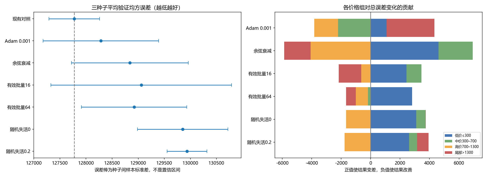

# 训练调优阶段实验报告

**当前进度：** 训练调优实验一至八本轮研究已结束，最终保留原配置。实验七复用历史回放与实现验收，不计作新训练。增强阶段另建05目录，开展实验一、五、六、七。

更新：2026年10月4日。本文为04训练调优唯一阅读报告；03传统参照由其他同学维护。单种子未晋级的候选不能描述为已证实跨种子无效。

## 一、结论与推荐配置

保留**直接拉伸＋AdamW，学习率0.0001固定不变＋有效批量32＋随机失活0.5**。目前完成三种子复核的替代方案均未满足预登记选择条件，不因单次改善而更换配置。这是当前数据、划分和搜索范围内的选择，不代表这些参数普遍最优。

| 三种子方案 | 验证均方误差均值±样本标准差 | 相比对照 | 同种子获胜 | 决定 |
| --- | ---: | ---: | ---: | --- |
| 原有对照 | **127774.42±486.30** | — | — | 保留 |
| Adam，0.001 | 128284.31±1106.07 | 差0.40% | 1/3 | 不替换优化器 |
| 余弦学习率衰减 | 128840.02±1118.86 | 差0.83% | 0/3 | 保留固定学习率 |
| 有效批量16 | 129059.34±1731.40 | 差1.01% | 1/3 | 不采用 |
| 有效批量64 | 128921.62±1010.05 | 差0.90% | 0/3 | 不采用 |
| 随机失活0 | 129852.20±866.67 | 差1.63% | 0/3 | 不采用 |
| 随机失活0.2 | 129936.07±380.91 | 差1.69% | 0/3 | 不采用 |
| L2惩罚，系数0.000001 | 128109.33 | 差0.26% | 2/3 | 不采用 |
| Xavier卷积初始化 | 128036.15±1036.47 | 差0.20% | 2/3 | 不采用 |

随机失活0.2的种子间波动较小，但三个种子都更差，说明“稳定”不等于“准确”。只有三个种子，表中标准差不应解释成统计显著性检验。

## 二、控制条件与判定方式

训练6399张、验证1601张，使用同一冻结的分组划分。种子2026、2027、2028改变初始化、训练顺序和随机失活，不改变划分。测试集不参与方案选择。

所有实验使用从零训练的AlexNet，无数据增强；输入224×224直接拉伸、固定均值与标准差0.5、不滤波。实际每批4张，默认累积8次；权重衰减0.0001、单精度。最多60轮，最少40轮，连续15轮未达到0.1%的有效改善才允许早停。每轮仍按严格最低验证均方误差保存最佳权重。

价格单位沿用数据中的千美元，均方误差是该单位的平方；训练损失使用价格除以1000后的目标，不能直接与原价验证误差比较。训练曲线中的32张固定探针仅用于快速诊断；正文的训练误差来自最佳检查点对全部6399张训练图片的无增强评估。

候选必须三种子平均误差降低，且至少两个同种子改善，才予以保留。多个候选符合时取均值最低者；未符合则保留对照。每次只改变登记因素，已存在的相同配置结果复用，不当作新的独立实验。迁移后核心训练逻辑、原图、缓存、独立重算输入及初始化一致性均有检查记录。代码版本变化明确登记，不能把它说成完全未发生迁移。

## 三、实验一与实验二：学习率和优化器

### 研究依据与初筛

先排查更新幅度是否不合适，再比较优化器及其配套学习率。以下均为种子2026的初筛结果，不能与三种子均值混作同等证据。

| 优化器 | 学习率 | 验证均方误差 | 分析与处理 |
| --- | ---: | ---: | --- |
| AdamW | 0.00003 | 129337.64 | 低于原学习率未改善，不继续 |
| AdamW | 0.0001 | **128268.67** | 本优化器保留配置，已有三种子 |
| AdamW | 0.0003 | 128756.28 | 增大更新幅度未改善，不继续 |
| 带动量随机梯度下降 | 0.0005 | 128217.55 | 仅改善0.04%，未追加三种子，不能认定优于对照 |
| 带动量随机梯度下降 | 0.001 | 136180.44 | 明显退步 |
| Adam | 0.00001 | 129077.46 | 未改善 |
| Adam | 0.0001 | 129665.89 | 未改善 |
| Adam | 0.001 | **127743.92** | 初筛改善0.41%，进入复核 |
| Adagrad | 0.001 | 129843.50 | 未改善 |
| Adagrad | 0.01 | 141196.58 | 第60轮仍为最佳，当前预算内较弱，不单独延长 |
| Muon混合更新 | 0.005 | 128231.59 | 仅改善0.03%，耗时327.56分钟，后续探索终止 |

失败与取消也计入搜索记录：随机梯度下降0.01出现非有限损失，0.03按用户要求取消；Adagrad 0.1出现非有限梯度；Muon 0.01完成两轮后由用户停止，不参与排名，0.02未运行。Muon仅更新两层隐藏全连接权重，其他参数由AdamW更新，不能称为全网络纯Muon。

根据用户后续授权，复核范围缩减为Adam 0.001；未完成所有优化器的三种子穷举。相同衰减系数在Adam和AdamW中的作用语义不同，不能把差异完全归于优化器名称。

### Adam复核与原因

| 种子 | AdamW对照 | Adam 0.001 | 最佳轮次／实际轮数 |
| --- | ---: | ---: | ---: |
| 2026 | 128268.67 | 127743.92 | 34／49 |
| 2027 | 127296.48 | 127552.31 | 30／45 |
| 2028 | 127758.11 | 129556.69 | 48／60 |

2026的小幅收益未复现，另外两次退步。三种子平均高价尾部均方误差从679580.17升到712285.84；尾部对总误差变化贡献约+3248，中间价位的改善不足以抵消。预测价格的离散程度也明显小于真实价格，存在向均值收缩的现象，但这不能单独证明原因是学习率过大或梯度异常。

2027早期平台之后仍在第30轮达到最佳，2028最佳第48轮，说明不能一概认为“前十轮没有进步就可以停止”。决定：保留AdamW，不再仅依据种子2026换优化器。

## 四、实验三：固定学习率与余弦衰减

仅改调度方式：衰减周期60轮、最低初始学习率的1%，不加预热。其余条件相同。

| 种子 | 固定学习率 | 余弦衰减 | 余弦最佳轮次／实际轮数 |
| --- | ---: | ---: | ---: |
| 2026 | 128268.67 | 130004.28 | 7／40 |
| 2027 | 127296.48 | 127772.89 | 9／40 |
| 2028 | 127758.11 | 128742.90 | 7／40 |

三个种子都退步。价格分组表明，低价与中价误差增加超过高价组改善；平均绝对误差也从264.52升到272.25。后期训练损失下降未转化为更好的验证误差，继续改善训练拟合并不足以解决泛化问题。

不能据此认定“余弦衰减总是无效”：三组都在40轮早停，没有完整走完60轮衰减周期。结论限定为**当前调度与共同早停协议的组合不优于固定学习率**。若以后研究周期或早停交互，需要独立登记并配套对照。当前不采用。

## 五、实验四：有效批量

### 为什么做，以及改了什么

检验梯度累积量是否影响稳定性和泛化。实际每批固定4张，只改累积次数：4、8、16次，对应有效批量16、32、64；学习率不自动缩放。最后不足一个有效批量的窗口按真实样本数归一化。

| 有效批量 | 每轮参数更新次数 | 种子2026 | 种子2027 | 种子2028 | 候选最佳轮次 | 新训练总耗时 |
| --- | ---: | ---: | ---: | ---: | --- | ---: |
| 16 | 400 | 127350.80 | 130812.73 | 129014.49 | 6／8／7 | 90.04分钟 |
| 32，对照 | 200 | 128268.67 | 127296.48 | 127758.11 | 40／57／7 | 复用已有结果 |
| 64 | 100 | 130082.09 | 128442.35 | 128240.43 | 5／7／7 | 71.52分钟 |

所有新增组均训练40轮。批量16三种子总更新48000次，批量64为12000次。因此本实验是**相同轮数上限、不同更新次数**的比较，不是严格相同更新预算，也不能只将结果解释为梯度噪声大小。衰减同样按更新步执行，累积总作用也随步数变化；本轮未单独隔离这一因素。

### 结果来源与可能机制

批量16只在2026改善，另外两个种子退步，种子间标准差1731.40，高于对照486.30。批量64三次均退步。两者的三种子平均尾部误差反而略有下降，说明总体退步并非都由最贵房屋造成。

直接证据是低价组偏高更明显：对照的低价平均有符号误差约+344.46，批量16为+374.90，批量64为+386.54。低价组对总误差变化分别贡献+2429.28和+2817.81，高价组改善不足以抵消。

改变累积次数会改变优化轨迹与每轮更新频率，这与不同的最佳轮次和种子稳定性相符，但不能证明“16必然噪声太大”或“64必然欠拟合”。这些说法需要梯度方差或等更新预算的追加实验。当前16既未稳定获益，又比64的同轮数训练更慢；64虽更新更少，但验证表现没有达到替换条件。**保留32，不为追求更快而接受未经登记的精度下降。**

## 六、实验五：随机失活概率

### 为什么做，以及改了什么

在实验四选定的有效批量32上，检查0.5是否抑制学习，或降低正则化能否改善预测。只改两处隐藏全连接层的随机失活概率，结构、学习率和衰减不变；验证时关闭随机失活。0.5复用原有对照，新增0和0.2各三个种子。

| 随机失活概率 | 种子2026 | 种子2027 | 种子2028 | 最佳轮次 | 实际轮数 | 新训练总耗时 |
| --- | ---: | ---: | ---: | --- | --- | ---: |
| 0 | 130200.52 | 130490.53 | 128865.57 | 6／3／6 | 40／40／40 | 76.32分钟 |
| 0.2 | 129582.65 | 129886.02 | 130339.53 | 43／3／7 | 58／40／40 | 86.99分钟 |
| 0.5，对照 | 128268.67 | 127296.48 | 127758.11 | 40／57／7 | 55／60／40 | 复用已有结果 |

### 不能把全部退步都归因于过拟合

降低随机失活的六次比较全部弱于对应种子的0.5；两个候选平均绝对误差也更高，当前不是通过牺牲均方误差换取了更低绝对误差。

但“降低随机失活才导致过拟合”并不符合全部证据。下表是各自最佳验证检查点的完整训练集误差，不能与最后一轮训练损失混用。

| 概率 | 种子2026训练／验证误差 | 种子2027训练／验证误差 | 种子2028训练／验证误差 |
| --- | --- | --- | --- |
| 0.5 | 8020.86／128268.67 | 5089.31／127296.48 | 117938.24／127758.11 |
| 0.2 | 5972.93／129582.65 | 127808.07／129886.02 | 109861.18／130339.53 |
| 0 | 104452.52／130200.52 | 127090.97／130490.53 | 111778.28／128865.57 |

0.2的2026种子确实存在显著泛化差距，但原0.5的2026、2027同样如此；0.2的2027最佳点训练与验证误差却都较高。早期选中点与晚期选中点体现不同的拟合程度，不能用单一过拟合解释覆盖所有种子。

更一致的结果来源是低价组偏高：0、0.2的低价平均有符号误差分别约+385.57、+382.97，都高于0.5对照+344.46。低价组解释了大部分总误差退步；高价组部分改善，却不足以抵消。随机失活改变训练中的扰动和优化轨迹，可能有助于抑制对训练特征的依赖，但这只是与结果相容的机制解释，本实验没有直接测量特征依赖或证明因果。

**决定：保留0.5。** 现有证据不支持“0.5太大”；也没有证明所有比0.5小的值都不行。本轮不追加0.1或0.3，以免在两个较低候选均失败后无依据地扩大搜索。若以后模型容量、增强或数据量改变，再重新评估。

## 七、跨实验误差定位与下一步建议

下表按三个种子平均，计算每个价格组对“候选减对照”总均方误差的贡献：组样本占比×组均方误差差。四列相加等于总变化，正数使结果变差，负数使结果改善。低价、中价、高价、尾部分别169、775、498、159张，价格边界只用于解释，不参与重新划分或训练。

| 候选 | ≤300 | 300–700 | 700–1300 | >1300 | 总变化 |
| --- | ---: | ---: | ---: | ---: | ---: |
| Adam 0.001 | +1080.17 | −2214.57 | −1603.82 | +3248.10 | +509.89 |
| 余弦衰减 | +4613.31 | +2318.17 | −4068.39 | −1797.48 | +1065.61 |
| 批量16 | +2429.28 | +1021.22 | −634.58 | −1530.99 | +1284.92 |
| 批量64 | +2817.81 | −180.88 | −815.06 | −674.67 | +1147.21 |
| 随机失活0 | +3097.36 | +628.10 | −1662.45 | +14.78 | +2077.79 |
| 随机失活0.2 | +2609.62 | +548.37 | −1767.63 | +771.28 | +2161.65 |

此前自动逐组说明取“绝对贡献最大的分组”，有时指向的是改善来源，并非恶化原因。本次统一列出正负贡献，纠正只看单个分组就判断原因的表达。分组贡献是算术误差分解，不等于对网络机制的因果解释。

共同局限是低价高估、高价低估，以及明显的训练验证差距。仅靠学习率、批量与随机失活的小范围变化，没有解决这个问题。已有结果支持继续按设计开展正则化实验，但需要无惩罚共同对照，分别研究显式惩罚与解耦衰减，不同时打开多个机制。实验六随后获得用户授权，执行登记见第九节。

也不建议立刻把最少轮数从40减到10：原对照有第40、57轮最佳，Adam有第30、48轮最佳，随机失活0.2也有第43轮最佳。后续早停研究可先离线重放现有曲线，量化节省轮数和错过最优点的代价；未完成这一步前不把潜在节省当作已验证收益。

## 八、成本、记录与复现

实验四、五共12次新训练，训练循环计时合计324.87分钟，约5小时25分钟；其中包含逐轮验证和探针评估，不含每次启动核验、末尾完整训练集评估及全部分析开销。原对照来自更早运行，不能将其墙钟时间与新缓存运行直接归因比较。缓存构建成本另计；32个探针不是训练集大小。

实验一、二共10次已完成的新初筛，Adam追加2次复核，实验三3次，实验四6次，实验五6次，共27次完成的新训练；另复用3次预处理对照。本汇总保留30条完成结果，不把失败、中断或重复引用计算为独立成功实验。

| 位置 | 内容与用途 |
| --- | --- |
| [逐次指标汇总](analyses/completed_20261004/summary.json) | 30次完成结果，含种子、训练验证误差、轮数、成本及分组指标 |
| [三种子与误差贡献汇总](analyses/completed_20261004/aggregates.json) | 本文汇总表与图的数值来源 |
| [各次实验目录](runs/) | 指标、训练历史、曲线与逐次复核结果；旧说明按当时状态保留 |
| [迁移核验](migration_evidence.json) | 输入缓存与核心训练逻辑一致性证据 |
| [实验二、三完成状态](continuation_status.json) | 已结束的执行记录 |
| [实验四、五完成状态](batch_dropout_status.json) | 已结束的执行记录 |
| [选定配置](../../../scripts/experiments/configs/selected/) | 优化器、调度、批量与随机失活的后续继承入口 |

原始数据、逐图预测、最佳模型权重和完整日志留在本地，不上传GitHub；复核原始运行可通过汇总内运行编号定位。本文替代此前按执行时间反复追加的叙述；整理前报告在本机 `.local/report_archive/` 保存，Git历史亦保留之前版本。每个阶段仍只呈现一篇主报告。

## 九、实验六：权重正则化

**研究依据：** 训练误差明显低于验证误差，检验权重约束是否改善泛化。无惩罚与L1/L2实验关闭优化器衰减；衰减实验关闭显式惩罚，避免叠加。其余设置固定。按用户缩减预算要求先筛选种子2026，仅对胜出候选追加2027/2028，共完成11次新训练。

| 配置 | 种子2026验证误差 | 相比原配置 | 后续与决定 |
| --- | ---: | ---: | --- |
| 原衰减0.0001 | 128268.67 | — | 复用三种子对照 |
| 无惩罚、无衰减 | 128268.67 | 0.00 | 三种子均与原配置相同；未证明更优 |
| L1，系数0.0000001 | 129582.36 | +1313.69 | 初筛不晋级 |
| L1，系数0.000001 | 130250.43 | +1981.76 | 初筛不晋级 |
| L2，系数0.000001 | 128113.38 | −155.29 | 晋级复核，最终未通过 |
| L2，系数0.00001 | 131258.04 | +2989.37 | 初筛不晋级 |
| 衰减0.00001 | 128268.67 | 0.00 | 未改善，不晋级 |
| 衰减0.001 | 130368.42 | +2099.75 | 初筛不晋级 |

L2系数0.000001的另两个种子分别为128516.48和127698.12；三种子均值128109.33，比对照差0.26%。虽然两次配对改善，但2027退步1220.00，抵消了另两次的小幅收益，因此不采用。

**误差定位：** 较强L2与衰减0.001在2026的低价组贡献分别恶化5792.82与5896.89，而高价组分别改善5563.62与5719.31，整体退步包含不同价格段之间的抵消。晋级L2在2027的低价组贡献恶化3712.95，尾部改善2309.31仍不足补偿；2028则低价改善、高价退步。因此不能把减小权重范数或缩小训练验证差距直接当作泛化改善。

**建议：** 保留无显式L1/L2、衰减0.0001。无衰减与小衰减结果完全相同，当前证据不支持声称小衰减有效；是否与单精度更新幅度有关需单独数值核验，尚未作为结论。以后若研究正则化，应同时关注价格段偏差与无增强训练误差，而非只看惩罚项下降。本轮不追加系数搜索。

逐组权重范数、惩罚曲线与误差分解保存在runs及regularization_status.json。完整历史日志保留在本地；旧队列向精简队列的交接是计划停止，不计作模型训练失败。

## 十、实验七：提前停止证据复用

按用户要求复用此前的早停研究，不重复启动同等训练。这里完成的是**历史曲线回放与实现验收的归档**，不是新做了一组“关闭／开启早停”的三种子完整训练对照。

原始回放比较过最少15轮／耐心10、最少30轮／耐心15、最少40轮／耐心15和最少40轮／耐心20。历史直接拉伸曲线上，前两项会错过第40轮的最佳结果，验证均方误差由128268.67变为130918.00，退步2.07%；40／15保留了当时基线和拉伸两条曲线的最佳值。历史估算基线节省26.06分钟、拉伸节省6.52分钟，来自当时被跳过轮次的耗时相加，不能直接套用到现在的缓存运行。

本次另对当前选定配置已有三种子历史做离线回放，结果如下。没有训练新模型，且较早停止的记录存在未观察到的后续轮次，不能推断其后不会改善。

| 种子 | 已有历史长度 | 15／10模拟停止轮次 | 相比已观察最佳值的退步 | 当前40／15 |
| --- | ---: | ---: | ---: | --- |
| 2026 | 55 | 17 | 2.07% | 第55轮停止，保留最佳 |
| 2027 | 60 | 19 | 1.66% | 60轮内未触发，保留最佳 |
| 2028 | 40 | 17 | 0.00% | 第40轮停止；之后轨迹未知 |

因此继续沿用**最少40轮、耐心15轮、改善阈值0.1%、最多60轮**，不因为候选搜索缩减就同步缩短训练预算。早停与严格最佳检查点保存分开处理，恢复的是验证误差最低权重。实现验收覆盖停止边界、关闭早停、非有限指标拒绝和最佳权重恢复。不能将其描述为已证明任何初始化或其他配置都能安全停止。

证据已复制到本阶段：[历史回放数值](analyses/early_stopping_reuse/historical_replay.json)、[原始说明存档](analyses/early_stopping_reuse/historical_review.md.txt)、[历史恢复测试](analyses/early_stopping_reuse/historical_test_evidence.txt)、[本次三种子离线回放](analyses/early_stopping_reuse/current_control_replay.json)。选定训练协议写入`configs/selected/training.json`，作为实验八的直接对照；这是证据复用，不增加独立实验次数。

实验八已完成卷积初始化比较，详见下一节。默认与候选的卷积权重允许不同，全连接权重、所有偏置和输出层的一致性已核验。

## 十一、实验八：卷积初始化检查

**研究依据与控制：** 按用户要求检验初始化敏感性，不预先认定初始化错误。只将五层卷积的Kaiming正态初始化换成Xavier均匀初始化（默认增益1）。全连接、偏置、输出层及其他条件保持相同；三种子的参数指纹核验通过。训练侧4张图的预检梯度均有限，不代表正式训练只用4张图。

| 种子 | Xavier验证误差 | 原初始化 | 差值 | 最佳轮／总轮 |
| --- | ---: | ---: | ---: | ---: |
| 2026 | 128209.69 | 128268.67 | -58.98 | 9/40 |
| 2027 | 128974.89 | 127296.48 | +1678.41 | 9/40 |
| 2028 | 126923.86 | 127758.11 | -834.25 | 9/40 |

**结果与选取：** 三种子均值128036.15，对照127774.42，整体差0.20%；两次改善不足抵消2027的退步，保留Kaiming初始化。三次最佳点均在第9轮，按共同早停规则运行40轮，恢复第9轮权重。

**误差定位：** 2026的低价组贡献恶化3495.77，其他价格组的改善将总差值抵消至−58.98；2027低价组恶化6162.09，是主要退步来源；2028尾部改善4894.09，是该种子主要改善来源。Xavier最佳模型训练验证差距约1.2万至1.9万，但较小差距没有带来更优平均验证结果，不能据此认定过拟合已得到有效解决。预检Xavier初始卷积梯度较小只说明初始尺度不同，无法单独证明最终结果的原因。

**建议：** 不追加初始化搜索。将原初始化作为增强阶段固定条件，避免增强与初始化同时变化。逐组指标及曲线见runs/tune_08_initialization，初始化指纹与预检见analyses/initialization/preflight.json。

## 十二、冻结配置与阶段交接

训练调优本轮结束：直接拉伸224×224、AdamW固定学习率0.0001、有效批量32、随机失活0.5、衰减0.0001、无显式惩罚、默认Kaiming初始化。早停最少40轮、耐心15、阈值0.1%、上限60；始终选择验证集最低误差检查点。

增强阶段见[唯一阶段报告](../05_augmentation/实验报告.md)。先单独研究水平翻转、旋转、平移、轻度裁剪，复用相同冻结划分和无增强三种子对照。每组只改变一种增强；改进原因以逐价格段误差和泛化差距定位，机制解释保留不确定性。
