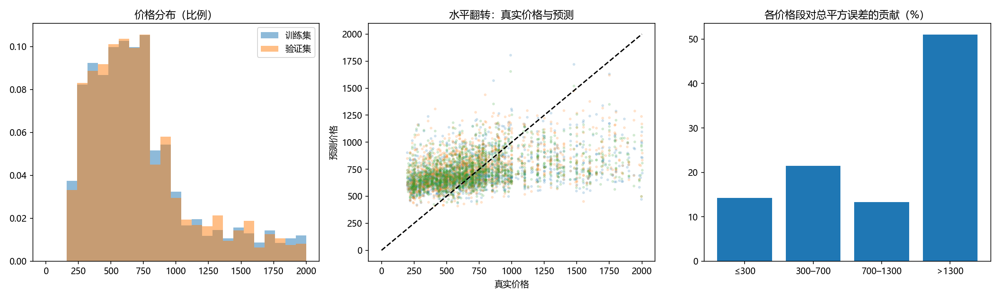
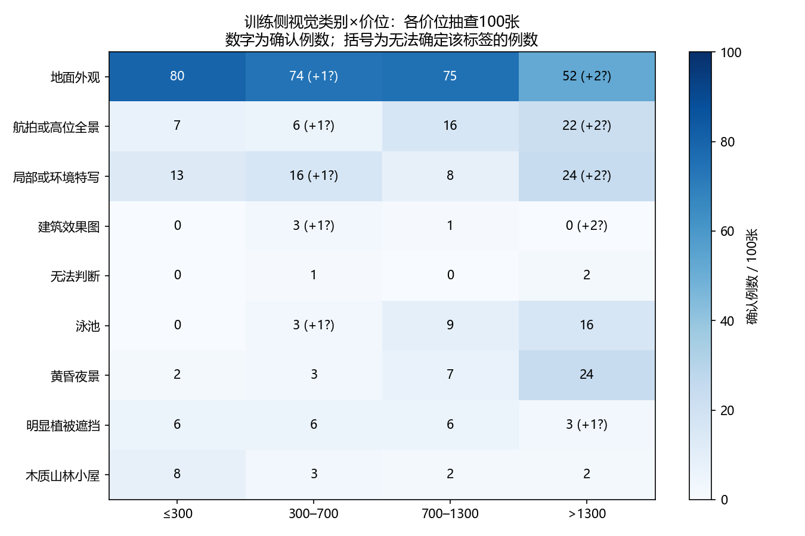

# 数据增强阶段实验报告

当前进度：实验八、九、十及必要复核完成；队列结束。更新时间（UTC）：2026-10-04T13:26:29.582408+00:00。

## 一、结论与阅读说明

**已完成的几何类实验推荐水平翻转，概率50%。** 三种子平均验证均方误差126810.01，相比无增强127774.42改善0.75%，三次配对中两次改善。第三个种子退步，不能解释为稳定或普遍有效。旋转、平移、裁剪均在单种子初筛未通过，不追加训练。

本次继续单独研究高斯模糊、高斯噪声与局部擦除，尚未完成前不改变已选翻转方案。每项仍与无增强对照比较，不叠加翻转；这样才能定位单项贡献。组合需要另行登记。本文是增强阶段唯一阅读报告，逐次曲线和机器记录在runs及analyses中。

## 二、固定条件与判定规则

冻结训练6399张、验证1601张及分组索引，种子2026/2027/2028不改变划分。AlexNet从零训练；直接拉伸224×224、固定归一化、默认Kaiming初始化、AdamW固定学习率0.0001、有效批量32（4×8）、随机失活0.5、衰减0.0001、无显式惩罚。最少40轮、耐心15、有效改善阈值0.1%、最多60轮；选择严格最低验证误差的检查点。测试集不参与选择。

仅训练图增强，顺序为原图→增强→拉伸→归一化；验证、固定训练探针和最佳模型的完整训练集评价均关闭增强，使用核验后的确定性缓存。不会固化一次随机增强并逐轮重复。

新增三项依次用2026初筛，完整性通过且严格优于同种子无增强对照的候选中，最多取误差最低两项追加2027/2028；预计3–7组。采用仍需三种子均值下降且至少两次配对改善。最终在符合条件的新候选与已验证的翻转中按均值推荐一个单项；不会因本轮新候选失败而丢弃翻转。候选间的小差异不代表统计显著，反复使用同一验证集存在选择偏差。

## 三、已完成的翻转与几何实验

| 实验 | 参数 | 种子2026验证误差 | 相对无增强 | 处理 |
| --- | --- | ---: | ---: | --- |
| 无增强 | 固定对照 | 128268.67 | — | 三种子均值127774.42 |
| 一：水平翻转 | 概率50% | 126601.97 | −1666.70 | 三种子复核后采用 |
| 五：小角度旋转 | 概率30%，±3° | 129526.18 | +1257.51 | 初筛未通过 |
| 六：小幅平移 | 概率30%，横纵各±3% | 129162.73 | +894.06 | 初筛未通过 |
| 七：轻度裁剪 | 概率30%，保留90%–100%面积 | 130222.98 | +1954.31 | 初筛未通过 |

### 水平翻转的复核与归因

| 种子 | 翻转验证误差 | 同种子对照 | 差值 | 最佳轮／总轮 |
| --- | ---: | ---: | ---: | ---: |
| 2026 | 126601.97 | 128268.67 | -1666.70 | 9/40 |
| 2027 | 125020.35 | 127296.48 | -2276.14 | 13/40 |
| 2028 | 128807.71 | 127758.11 | +1049.60 | 7/40 |

2026的高价和尾部组改善抵消了低价组退步；2027尾部与高价组贡献分别改善6129.88和4547.77，超过低价与中价组退步；2028则主要因中价组退步1214.04而整体变差。收益来自价格段间的取舍，并非所有房价区间都改善。水平翻转可能降低左右构图依赖，但这里只测量了误差变化，未直接证明特征机制。

### 其他几何方案为什么没有保留

旋转的尾部与低价组退步贡献分别为3770.96、2145.58，中价改善4337.63不足抵消。平移的低价组退步3045.92及尾部退步1601.01抵消了中高价改善。裁剪的低价与中价退步贡献为6205.57、2989.07，虽然高价与尾部改善，整体仍更差。裁剪最佳模型训练误差127504.88、验证130222.98，两者接近但均较高，因此不能把小泛化差距当作效果好。

这些变换可能损失边缘环境、改变构图或引入填充，但当前证据不能区分各机制。建议维持原幅度的失败记录、不叠加到翻转；若以后重试，应先明确诊断依据，再单独研究更弱幅度或边界处理。单种子落选不能证明所有幅度、种子都无效。

## 四、新增实验：依据、参数与风险

| 实验 | 固定参数 | 研究问题与检查重点 |
| --- | --- | --- |
| 八：高斯模糊 | 概率20%，5×5核，标准差0.3–0.8原图像素 | 检验对锐利细节的依赖；可能削弱屋面与外墙纹理 |
| 九：高斯噪声 | 概率20%，零均值，标准差0.01 | 在0–1原图张量上加噪并截断至0–1；检验微弱像素扰动的鲁棒性 |
| 十：局部擦除 | 概率15%，面积1%–3%，宽高比0.5–2 | 填充灰色0.5，最多尝试10次；检验局部遮挡，记录触发与放置失败 |

本轮依据是已有训练验证差距，探索纹理和局部区域依赖，不声称数据已经证实存在模糊或噪声问题。模糊与噪声发生在原图尺度，随后缩小可能明显减弱扰动；若无收益，只能否定当前位置与幅度的候选，不能直接推断操作本身无效。擦除可能覆盖房屋关键部位，因此先检查固定训练图片预览。

## 五、新增结果与逐组分析

| 实验 | 种子 | 验证均方误差 | 相比同种子无增强 | 最佳轮／总轮 | 触发率 |
| --- | ---: | ---: | ---: | ---: | ---: |
| 实验八：高斯模糊 | 2026 | 129941.36 | +1672.69 | 9/40 | 20.0% |
| 实验九：高斯噪声 | 2026 | 131174.53 | +2905.87 | 5/40 | 20.1% |
| 实验十：局部擦除 | 2026 | 128114.40 | -154.27 | 7/40 | 15.0% |
| 实验十：局部擦除 | 2027 | 127559.81 | +263.32 | 8/40 | 15.0% |
| 实验十：局部擦除 | 2028 | 129226.42 | +1468.32 | 10/40 | 15.0% |

**实验八：高斯模糊，种子2026：** 主要退步来源：尾部>1300，对总误差变化贡献+3798.38；主要改善来源：中价300–700，贡献-4506.38。这是误差分解，不是机制的因果证明。 无增强完整训练集误差104716.72，训练验证差距25224.64。本次验证未改善；训练损失下降不能单独支持采用。

**实验九：高斯噪声，种子2026：** 主要退步来源：低价≤300，对总误差变化贡献+6030.11；主要改善来源：高价700–1300，贡献-5698.60。这是误差分解，不是机制的因果证明。 无增强完整训练集误差127079.84，训练验证差距4094.69。本次验证未改善；训练损失下降不能单独支持采用。

**实验十：局部擦除，种子2026：** 主要退步来源：低价≤300，对总误差变化贡献+5813.86；主要改善来源：高价700–1300，贡献-6975.07。这是误差分解，不是机制的因果证明。 无增强完整训练集误差117818.25，训练验证差距10296.15。本次验证误差改善，是否采用以三种子决策为准。

局部擦除因无法放置而跳过0次；触发率与成功擦除率分别检查。

**实验十：局部擦除，种子2027：** 主要退步来源：尾部>1300，对总误差变化贡献+4473.36；主要改善来源：中价300–700，贡献-6166.61。这是误差分解，不是机制的因果证明。 无增强完整训练集误差112099.43，训练验证差距15460.38。本次验证未改善；训练损失下降不能单独支持采用。

局部擦除因无法放置而跳过0次；触发率与成功擦除率分别检查。

**实验十：局部擦除，种子2028：** 主要退步来源：高价700–1300，对总误差变化贡献+6463.25；主要改善来源：中价300–700，贡献-3955.23。这是误差分解，不是机制的因果证明。 无增强完整训练集误差93257.82，训练验证差距35968.60。本次验证未改善；训练损失下降不能单独支持采用。

局部擦除因无法放置而跳过0次；触发率与成功擦除率分别检查。

输入扰动诊断：以下仅在固定32张训练图上强制触发，用于检查缩放后的扰动强度；正式训练保持登记概率，不用这项指标选择模型。

实验八：高斯模糊：缩放后0–1像素尺度的平均绝对变化0.006403。

实验九：高斯噪声：缩放后0–1像素尺度的平均绝对变化0.003593。

实验十：局部擦除：缩放后0–1像素尺度的平均绝对变化0.004572。

## 六、选取建议与后续

实验八：高斯模糊种子2026复核完成：未达到追加种子条件。

实验九：高斯噪声种子2026复核完成：未达到追加种子条件。

实验十：局部擦除种子2026复核完成：进入候选排序。

追加种子候选：实验十：局部擦除。

实验十：局部擦除：候选三种子均值128300.21，对照127774.42，同种子获胜1/3；保留对照。

本轮推荐：实验一：水平翻转。未执行组合，不推断单项叠加有效。

每组训练结束先检查数据、配置、初始化、全部样本、增强统计和分价格段误差，写入本报告后才继续。当前授权范围内的三项及必要复核结束后停止，不自动加入亮度、颜色或组合实验。

## 七、证据与复现

旧几何阶段状态保留在analyses/geometry_completed.json。新增预检见analyses/robustness_20261004/preflight.json，含图片预览只留本地。runs按实验与运行编号保存损失、验证误差和学习率曲线；固定32张训练探针不等于训练集只有32张。完整权重、逐图预测和日志保存在.local/experiment_record/05_augmentation。

## 八、2026年10月5日：分价位、困难图像、学习曲线与划分复核

本节是完成11组增强训练后的只读审计，没有新增训练、修改划分或重选检查点。指标直接从保存的逐图预测重新计算，划分由原始价格、分组和种子重新构建并逐项核对。价位与绝对误差沿用项目中的千美元单位；均方误差单位为其平方。

主要结论：价位分布没有明显训练／验证错配；当前模型将价格明显压向中间，低价高估、高价低估。高价端样本相对少且贡献了约一半平方误差，但仅凭这点不能证明某种视觉类别缺少训练样本。主体缺失、遮挡、外观与价格关联有限、背景敏感和后期过拟合可以同时存在。

### 8.1 不同增强对各价位的影响

下面用**同一2026种子**比较全部单项，数值是各价格段对“总验证均方误差变化”的贡献：本段样本占比×本段均方误差差。负数改善、正数退步，四列之和等于总变化。这种分解能定位误差来源，不等于因果机制。

| 方案 | ≤300 | 300–700 | 700–1300 | >1300 | 总变化 |
| --- | ---: | ---: | ---: | ---: | ---: |
| 水平翻转 | +4601 | -751 | -3948 | -1568 | -1667 |
| 小角度旋转 | +2146 | -4338 | -321 | +3771 | +1258 |
| 小幅平移 | +3046 | -2494 | -1259 | +1601 | +894 |
| 轻度裁剪 | +6206 | +2989 | -5933 | -1307 | +1954 |
| 高斯模糊 | +2697 | -4506 | -316 | +3798 | +1673 |
| 高斯噪声 | +6030 | +997 | -5699 | +1578 | +2906 |
| 局部擦除 | +5814 | +2568 | -6975 | -1561 | -154 |

各增强都存在价位间的取舍，不能只看总误差。翻转在2026主要改善中高价和尾部；模糊与旋转虽然改善中价，却损害低价和尾部；裁剪、噪声的中高价收益不足以补偿低价等组的恶化。

三种子复核后，翻转的四段总误差变化贡献依次为 **+3265、+1315、−2743、−2801**，合计改善964.41（0.75%）。也就是说，最终翻转方案牺牲了低价与中价表现，换来高价与尾部收益。局部擦除三种子贡献依次为+1683、−2518、−549、+1910，整体退步525.79，不采用。未复核候选的单种子结论不能描述为跨种子稳定。

### 8.2 当前最好方案的系统性误差

下表对三个独立翻转模型分别计算指标再平均，**不是对预测求平均后的集成模型效果**。平均偏差=预测−真值；正数表示高估。

| 价位 | 验证样本数 | 平均绝对误差 | 平均偏差 | 本段均方误差 | 占总平方误差 |
| --- | ---: | ---: | ---: | ---: | ---: |
| ≤300 | 169 | 394.4 | +394.4 | 170897 | 14.2% |
| 300–700 | 775 | 193.5 | +181.3 | 56158 | 21.4% |
| 700–1300 | 498 | 182.6 | -111.3 | 54318 | 13.3% |
| >1300 | 159 | 764.7 | -763.5 | 651374 | 51.0% |

低价≤300组的三个模型预测全部高于真实值，平均高估394.4；高价>1300组平均低估763.5。这是显著的预测范围压缩：验证真实价格标准差389.8，三个模型预测标准差仅152.5、165.3、146.3；验证最低真实价格195，但各模型最低预测约410–428。三种子平均决定系数约0.165，说明相较常数预测有所改善，但仍有很大未解释误差。

这一偏差不只出现在验证集：最佳检查点对完整训练集的无增强评估中，低价平均偏差约+372.0、高价尾部约−733.3，与验证同方向且接近。因此不能把两端偏差主要解释为验证集抽偏。最佳检查点仍未学到足够可泛化的两端定价信号；继续训练虽然拟合训练样本更好，验证却进一步退步。

按三个模型的逐图平方误差均值排序，最差24张（1.50%样本）贡献15.84%的总平方误差，全部价格>1300；最差161张（约10%）贡献55.27%，其中125张>1300。若改按相对绝对误差排序，关注点转到低价房：这与平方误差偏重绝对差额共同说明必须同时报告分段绝对误差、偏差与相对误差，不能只报告一个总分。

### 8.3 困难图片：看到了什么，尚不能证明什么

检查范围预先固定为：整体平方误差最高24张、相对误差最高24张、价格≤700中平方误差最高24张、高价验证中误差最低24张，以及随机抽取24张高价训练图片。各集合有重合，不能相加当作独立图片数量。类别描述来自人工观察，并非数据集原有类别标签，未对全部8000张做语义标注。

| 可见场景 | 实例及三模型平均预测 | 支持的解释与边界 |
| --- | --- | --- |
| 主体缺失或被遮挡 | 584.jpg主要是入口铁门和植物，1799→686；1208.jpg房屋远且树木、围栏占据较多画面，1800→745 | 图片对建筑本身提供的信息有限；仅放大或增强不一定补回缺失信息 |
| 主体清楚但仍严重低估 | 2138.jpg木质房屋，1995→491；4471.jpg白色现代建筑，1775→679；7184.jpg现代外立面，1938→663 | 不能只归因于遮挡、模糊或看不到房屋；模型可能缺乏区分价格的表征，且单张外观未必包含定价因素 |
| 低价却被高估的木屋与庭院 | 52.jpg木屋，267→1101；5767.jpg泳池庭院，269→895 | 同类可见风格并不唯一对应价位；泳池、景观等可能是相关线索，也可能造成误导 |
| 非普通实拍或视角偏离 | 6972.jpg建筑效果图，325→1061；7905.jpg俯瞰街区/地块，380→1052 | 存在图片类型、主体尺度差异；是否为训练稀缺类别还需全量类型计数 |

在高价误差较小的样本中也观察到泳池、夜景、庭院和航拍，在随机高价训练样本中同样能见到上述元素。因此不能看到“泳池／夜景”就认定必然困难或训练没有该类型。不同外观类别内部的价格仍可能很分散。价格受位置、面积、产权或房况等未直接出现在单张照片中的因素影响是合理假设，但当前输入只有图像与价格，不能从本实验量化各缺失因素的贡献，也没有证据据此认定标签错误。

**尾部稀缺的证据强度：** >1300的训练图636张，占9.94%，中价300–700有3111张，前者约为后者五分之一；高价覆盖相对稀少已被计数证实。不过高价组在验证中占比同样约10%，并非验证额外塞入更多高价图。更关键的是“木屋高价”“效果图低价”等视觉×价格子群是否稀少，目前没有全量语义标签，不能作确定结论。价格标签最高为2000，但尚未确认这是截断、采样边界还是自然范围，不能解释为超过2000的未见价格外推。

**背景干扰的补充检查：** 对6张明确列出的验证图片，使用2026最佳检查点做7×7网格、每块32×32的灰色遮挡推理，未更新参数。5767.jpg遮挡泳池附近一块后预测最多降低58.4；192.jpg树木／车道附近一块遮挡后反而升高126.1；6972.jpg坡地与植被附近一块遮挡后降低99.8。说明这些局部区域影响输出，但“移除后升高”不能解释成该区域原来在抬价。两张主体清晰的高价图2138、4471最大单块变化仅约22.6、15.0，远小于上千的预测误差，不能用某个局部背景物体解释全部误差。

遮挡会产生训练分布之外的灰块，各网格相互作用也不独立；这是一种局部敏感性诊断，不是注意力真值或实体因果证明。样本按问题选择、仅一个种子，不能外推为全部数据的类别结论。图片、逐图清单和遮挡图保留在本地 `.local/experiment_record/05_augmentation/error_review_20261005/`，不上传原图。

### 8.4 为什么训练损失下降而验证误差波动

先区分三个量：训练损失来自价格除以1000后的平方误差，并在训练模式下启用随机失活和增强；原价验证均方误差需对应乘以1000000，但由于模式和样本不同，二者仍不等同。曲线中的训练探针仅32张，不是全部训练样本；完整训练误差只在恢复最佳权重后统一计算。

验证代码每轮使用固定1601张图、关闭增强并调用model.eval()，随机失活不生效。故当前波动不能归因于每轮重新抽验证样本、验证随机增强或验证时忘记关闭随机失活。

| 翻转种子 | 最佳轮 | 最佳轮训练损失→第40轮 | 最佳验证误差→第40轮 | 最后10轮验证范围 |
| --- | ---: | --- | --- | --- |
| 2026 | 9 | 0.1257→0.0242 | 126602→139006 | 135724–145707 |
| 2027 | 13 | 0.1138→0.0221 | 125020→133460 | 133286–139854 |
| 2028 | 7 | 0.1334→0.0222 | 128808→139816 | 134848–145775 |

这不是“再训练一点验证就一定收敛”的证据。三个种子都在早期达到最低验证误差，之后训练持续改善而验证变差，支持后期过拟合；验证上下波动叠加在泛化退步上。优化器只优化训练目标，没有保证验证误差单调下降。模型约5701万参数、训练6399张，从零训练存在很大的拟合自由度；不过参数多本身不能单独证明原因。

固定学习率、随机训练顺序、增强和随机失活会使更新轨迹持续变化；均方误差又对大残差敏感，10%的高价样本贡献约51%的平方误差，因此少数样本预测的变化可能明显改变总指标。由于没有保存每轮逐图预测，当前不能把每一次尖峰精确归因到某个价位或图片。余弦调度已在此前三种子实验失败，因此不能把“降低学习率”当作未经验证的必然解决办法。

早停是节约训练与选择权重的协议，不会迫使验证曲线收敛。当前最少40轮是为避免过去漏掉第40、57轮的后期改善；本轮增强最佳点更早，但事后改规则可能产生偏差。可在下一阶段预登记适合增强的停止比较，保留现有记录作为历史对照。

### 8.5 划分是不是随机，价位是否均衡

算法先将完全相同像素及登记的近重复图片组成组，以每组价格中位数排序，按排序秩分成十层，再用固定种子2026在每层随机选约20%的组作验证。7998组每层约800组，其中160组验证；展开图片后得到训练6399、验证1601。它是**固定的按价位分层的分组随机划分**，不是普通随机抽图，也不是k折交叉验证。

从原始清单重建得到完全相同的划分；冻结文件哈希一致。训练／验证的图片编号、group_id、pixel_hash交集均为0。这里的分组仅覆盖已检测或登记的重复图片，不保证不同照片的同一房屋、同一街区全部被分为一组，因为缺乏这些元数据。

| 价位 | 训练数量／比例 | 验证数量／比例 |
| --- | --- | --- |
| ≤300 | 680／10.63% | 169／10.56% |
| 300–700 | 3111／48.62% | 775／48.41% |
| 700–1300 | 1972／30.82% | 498／31.11% |
| >1300 | 636／9.94% | 159／9.93% |

训练与验证平均价格分别720.86、719.79，中位数都639.9，90%分位数都1300；两分布最大累计比例差约1.32个百分点。主要价格分布错配不是当前结果的主要证据来源。这里“均衡”是保持两边分布接近，**不是强行让四个价位段样本一样多**。分价位一致也不保证图像类型、地区或拍摄风格一致，后者还需标注或可靠元数据。

### 8.6 建议的验证顺序

1. 暂不重划分或重新搜索种子；保留现有共同对照。持续报告分价位样本数、平均绝对误差、偏差、尾部误差，避免总分掩盖低价退步。
2. 在训练侧建立少量清晰定义的人工标签：主体不可见／明显遮挡／效果图／航拍／泳池庭院等，允许多标签；先统一规则，再比较训练覆盖率和验证误差，才能判断视觉长尾。当前困难样本可用于制定规则，不能用其占比估计全数据分布。
3. 对主体清晰但两端预测压缩的问题，优先研究能改善泛化表征的结构方案，例如减小全连接头容量；在同一条件下做单因素对照，不同时换损失、采样和增强。训练调优中更强正则化并未有效，不能直接重复堆叠。
4. 若研究价位平衡采样或加权损失，应单独预登记，并报告它改变训练目标后对原始验证均方误差与低价表现的双向影响；不能直接按验证真实价格校准预测或选择模型分支。
5. 若研究主体区域，应保留全图参照，测试主体＋上下文，而非直接删掉背景：景观、庭院也可能是有用定价线索。当前裁剪和局部擦除失败，不支持盲目加强它们。

本次只完成审计和少量推理诊断，未启动以上新训练方案。完整聚合数值见[复核指标](analyses/error_review_20261005/metrics.json)，分析脚本为review_augmentation_results.py，遮挡脚本为review_occlusion.py。

## 九、训练侧视觉类别×价位覆盖实验（2026年10月5日）

### 9.1 完成范围与方法

按设计先登记规则，再从冻结的6399张训练图中按四价位各抽100张，共400张。抽样未使用预测或误差，验证和测试图片未参与本轮标注。各价位种子依次为20261005、20261006、20261007、20261008，展示打乱种子为20261005；具体清单哈希见registration.json。展示仅含代号，不显示价格、预测或误差；审阅者仍处于已有项目分析的上下文中，部分图片可能在此前查看过，不宣称完全独立盲审。

由助手逐图视觉审阅，完成400张标注，另随机回看40张，并对9张边界样本放大审查。本轮属于分层抽样覆盖率研究，**不是全量6399张标注**，剩余5999张没有被赋予阴性标签。所有图片及逐图标签均在本地，不上传到外部识别服务。未使用预训练视觉模型或启动新的房价训练。

主类型互斥：地面外观、航拍/高位全景、局部/环境特写、室内、效果图、无法判断。局部包括门口、阳台、泳池庭院、景观和地块等主体不完整视图；不能将其全部解释为“坏图”。高位全景要求明显向下俯视或大范围鸟瞰，轻微抬高机位仍归地面；无法可靠区分实拍与效果图则记未知。

场景标签允许同时出现：可见泳池（含人工水疗池，不自动把湖泊判为泳池）、黄昏夜景（以画面呈现判断，不能确认是否后期替换天空）、明显植被遮挡（约三分之一以上立面被遮挡，纯阴影不算）、木质/山林小屋外观（明确木质小屋或山林式尖顶小屋，普通尖顶和石墙不自动算）。这些是视觉外观标签，不是建筑材料或地理位置的真实元数据。

### 9.2 各价位的观察结果

每格均为100张中的确认例数，因此也对应抽样百分比。“+?数字”表示另有无法确定的样本；主类型的未知不应解释为其他类型确定不存在。附加标签可重叠，不能相加成为样本总数。

| 类别 | ≤300 | 300–700 | 700–1300 | >1300 |
| --- | ---: | ---: | ---: | ---: |
| 地面外观 | 80 | 74，+?1 | 75 | 52，+?2 |
| 航拍或高位全景 | 7 | 6，+?1 | 16 | 22，+?2 |
| 局部或环境特写 | 13 | 16，+?1 | 8 | 24，+?2 |
| 室内 | 0 | 0，+?1 | 0 | 0，+?2 |
| 建筑效果图 | 0 | 3，+?1 | 1 | 0，+?2 |
| 无法判断 | 0 | 1 | 0 | 2 |
| 泳池 | 0 | 3，+?1 | 9 | 16 |
| 黄昏夜景 | 2 | 3 | 7 | 24 |
| 明显植被遮挡 | 6 | 6 | 6 | 3，+?1 |
| 木质山林小屋 | 8 | 3 | 2 | 2 |

最明显的关系是：高价组更常出现泳池、黄昏夜景以及航拍／高位视图。低价与高价组泳池观察数为0对16，黄昏夜景为2对24，高位视图为7对22；普通地面外观为80对52。视觉风格和价格存在共现关系，不能直接解释成建筑面积、房产档次或位置的真实差异。

四价位实际训练数量为680、3111、1972、636，不能把本次各占25%的样本简单汇总。按真实数量加权后，已确认标签的估计覆盖率约为：地面外观72.76%、航拍/高位10.78%、局部/环境14.01%、泳池5.82%、黄昏夜景6.21%、明显植被遮挡5.70%、木质/山林小屋3.12%。含未知标签的比例仅是确认部分的估计，不是已校正未知后的完整覆盖率。

### 9.3 哪些子群可以列为覆盖不足候选

预登记规则是：阳性不超过5/100列为样本稀少候选，比例区间上界小于10%才能称本价位覆盖较低；训练数量估计区间上界小于50时列为绝对覆盖不足候选。50不是模型必需的通用样本数。区间为逐项Wilson 95%区间；遇到未知时，用“全部未知为阴性”的下界和“全部未知为阳性”的上界包络，不把未知当确定阴性。

| 优先核验子群 | 样本观察 | 本价位覆盖率95%区间 | 推算训练数量区间 | 结论 |
| --- | --- | --- | --- | --- |
| 泳池×≤300 | 0/100 | 0.0%–3.7% | 约0–25张 | 满足本次覆盖不足候选规则 |
| 黄昏夜景×≤300 | 2/100 | 0.6%–7.0% | 约4–48张 | 满足本次覆盖不足候选规则 |
| 木质山林小屋×>1300 | 2/100 | 0.6%–7.0% | 约3–45张 | 满足本次覆盖不足候选规则 |

**这三项最值得优先进行训练侧定向核验。** 低价泳池零例只能说明100张中未见到，不能说全训练集没有；高价木质/山林小屋为2例、估计约13张，区间约3–45张，也不能写成已确认只有13张。

效果图在低价样本为0例，中价3例、高价区间1例，最高价无确认例且有2例类型未知，提示需核验照片类型覆盖。室内样本同样零例，但当前数据以外观图为主，也没有本轮室内失败证据，不应因此优先补室内图。未知类别自身少不具有“该视觉类别缺数据”的含义。

明显植被遮挡的各价位观察数为6、6、6、3，最高价另有1例未知。最高价数量区间约7–63张，尚未满足本次绝对数量上界<50的规则；因此不能断言高价遮挡图已经证实绝对稀缺。航拍和局部环境视图在高价样本中反而更常见，不支持把它们整体描述为高价训练长尾。

抽样误差之外还存在主观边界、同一审阅者判断偏差和未校正的多重比较；95%区间不代表所有子群同时有95%覆盖保证。结论是筛选核验目标，不是完整数据集类别普查或可靠性认证。

### 9.4 与此前误差的联系

此前低价泳池图被高估，而本轮训练样本中泳池更多与高价共现，这为“模型把泳池当高价线索”提供了训练分布层面的相容证据。高价木屋被低估，也与本轮高价木屋较少相容。但本轮没有对验证集做同规则全面标注，不能计算这些类别的正式验证误差或证明共现关系造成预测偏差。

需区分两种问题：类别整体少，与类别常见但其某个价位子群少。例如夜景并非整体缺少，高价夜景观察24/100，低价只有2/100；若只增加高价夜景，未必能改善低价夜景的误判。也不能仅根据价格改变同一张验证图的预测分支，这会使用真实标签。

### 9.5 复核、数据问题与限制

随机40张同审阅者复核中，主类型一致40/40，全部字段一致38/40；2处差异均为植被遮挡，放大后修正，保留首次标注和修订理由。这不是两名独立专家的一致性，也不能作为标签准确率。另3张保留主类型未知；1张泳池字段未知、1张遮挡字段未知。

审阅还发现2767.jpg与5447.jpg画面高度相似，两张均在训练侧、价格同为1759，但像素哈希与现有分组不同；本轮作为疑似近重复另行登记。400张样本的图片、现有group_id及像素哈希均唯一，然而这对图片说明现有分组不保证穷尽所有近重复。它不构成已证实的训练／验证泄漏。当前冻结划分未修改，避免破坏历史可比性；下一版数据审计应核查这对及类似情况。高度相关样本也会使简单抽样区间略显乐观。

### 9.6 下一步建议与本轮完成状态

本轮已完成计划中的400张抽样标注、40张复核、未知处理、覆盖估计与稀缺候选筛选。当前推荐优先核查低价泳池、低价黄昏夜景、高价木质/山林小屋的剩余训练样本；定向发现的图片不能直接并入随机样本重新计算无偏比例，应作为独立的普查或检索核验记录。

后续只有确认子群覆盖与错误模式后，再决定是否试验训练侧平衡采样、分类别增强或表征改进。尚未授权或启动这些新训练；不改变现有训练／验证划分。几何增强失败也不意味着应自动加强裁剪、擦除来处理遮挡。

聚合统计：[coverage.json](analyses/visual_coverage_20261005/coverage.json)；抽样登记：[registration.json](analyses/visual_coverage_20261005/registration.json)；复核一致性：[qa.json](analyses/visual_coverage_20261005/qa.json)。可复现脚本为scripts/experiments/visual_coverage.py；逐图清单、原始/最终标签、复核与放大图在本地.local/experiment_record/05_augmentation/visual_coverage_20261005，不上传原图或价格标签。
